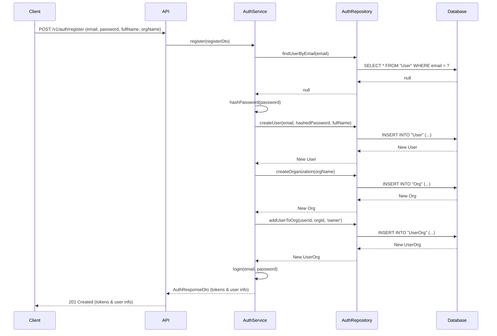
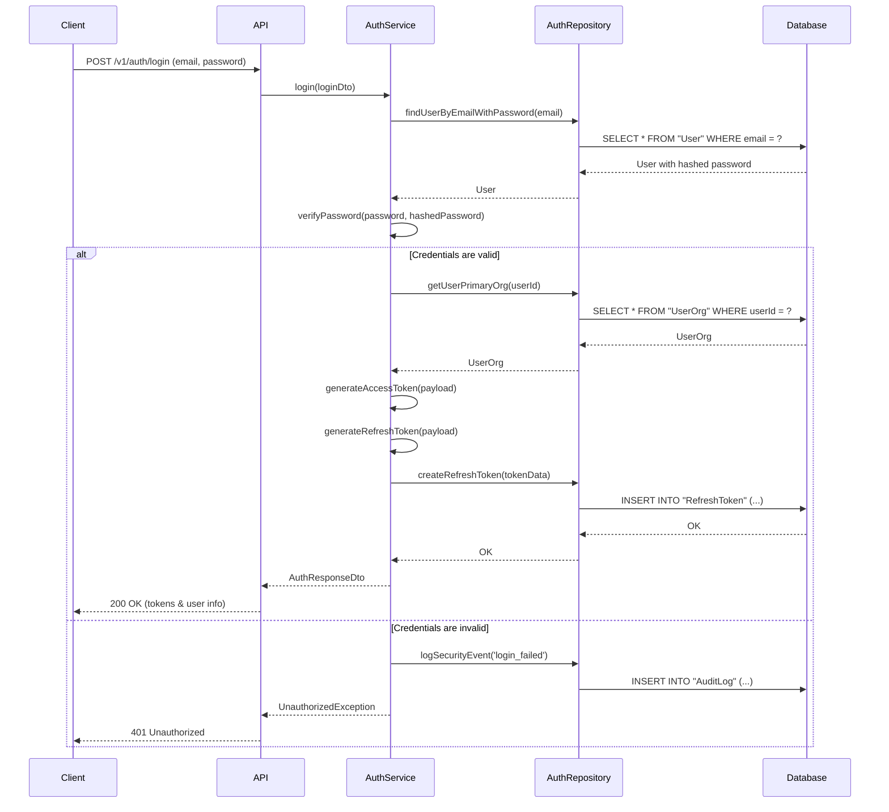
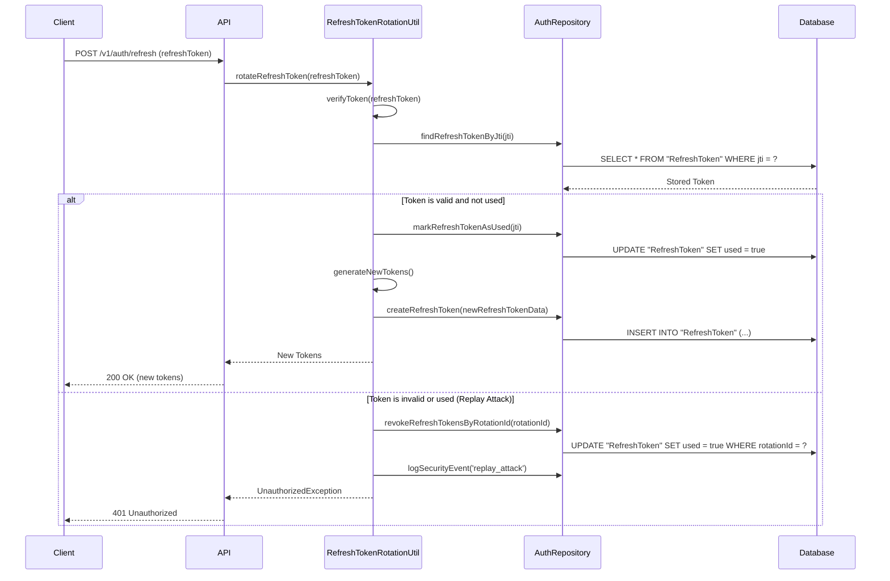
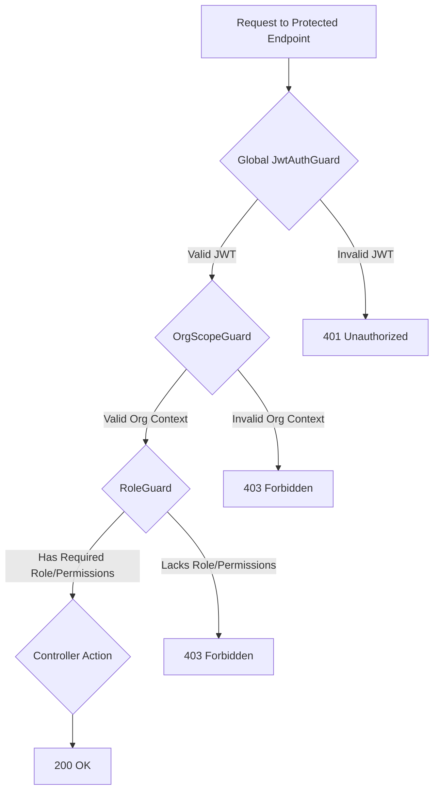

# DriveFlow Authentication & Authorization System

This document provides a comprehensive overview of the authentication and authorization system for the DriveFlow API. It is designed to be a technical reference for developers, explaining the architecture, key components, and security features of the system.

## Table of Contents

- [System Overview](#system-overview)
- [Core Technologies](#core-technologies)
- [Authentication Flow](#authentication-flow)
  - [1. User Registration](#1-user-registration)
  - [2. User Login](#2-user-login)
  - [3. Token Refresh](#3-token-refresh)
- [Authorization Flow](#authorization-flow)
  - [1. Global JWT Guard](#1-global-jwt-guard)
  - [2. Role & Permission Guards](#2-role--permission-guards)
- [Key Components](#key-components)
  - [AuthModule](#authmodule)
  - [AuthService](#authservice)
  - [AuthController](#authcontroller)
  - [AuthRepository](#authrepository)
  - [Guards](#guards)
  - [Utilities](#utilities)
- [Security Features](#security-features)
  - [Password Security](#password-security)
  - [JWT Security](#jwt-security)
  - [Refresh Token Rotation](#refresh-token-rotation)
  - [Token Revocation](#token-revocation)
  - [Audit Logging](#audit-logging)
- [API Endpoints](#api-endpoints)

---

## System Overview

The DriveFlow authentication and authorization system is a robust, secure, and scalable solution designed to protect our API and ensure that users can only access the resources they are permitted to. The system is built on a foundation of JSON Web Tokens (JWTs) and a sophisticated Role-Based Access Control (RBAC) model.

The key principles of our system are:

-   **Secure by Default**: All endpoints are protected by default, and public access must be explicitly granted.
-   **Stateless Authentication**: Our use of JWTs ensures that our authentication system is stateless, allowing for greater scalability.
-   **Granular Permissions**: Our RBAC model, combined with scoped permissions, provides fine-grained control over who can access what.
-   **Comprehensive Auditing**: All security-related events are logged, providing a complete audit trail for monitoring and incident response.

## Core Technologies

-   **NestJS**: Our API framework, providing a modular and scalable architecture.
-   **Passport.js**: The foundation of our authentication strategy, with a custom `JwtStrategy`.
-   **JSON Web Tokens (JWTs)**: Used for stateless authentication and secure information exchange.
-   **bcrypt**: For securely hashing and verifying user passwords.
-   **Prisma**: Our ORM, used for all database interactions.
-   **Zod**: For schema validation and type safety in our contracts.

---

## Authentication Flow

### 1. User Registration

New users can register for an account, which also creates a new organization with them as the owner.

### 2. User Login

The login flow validates a user's credentials and, if successful, issues a short-lived access token and a long-lived refresh token.

### 3. Token Refresh

When an access token expires, the client can use a refresh token to request a new one. Our system uses a secure token rotation and replay detection mechanism.

---

## Authorization Flow

Our authorization flow is designed to be both secure and flexible, using a series of guards to protect our endpoints.

### 1. Global JWT Guard

All endpoints are protected by default by a global `JwtAuthGuard`. This guard is the first line of defense, ensuring that every request has a valid, unexpired JWT. Endpoints that should be publicly accessible must be explicitly marked with the `@Public()` decorator.

### 2. Role & Permission Guards

After the `JwtAuthGuard`, we use our `RoleGuard` and `OrgScopeGuard` to enforce our more granular access control rules.

---

## Key Components

### `AuthModule`

The `AuthModule` is the central hub of our authentication and authorization system. It imports all necessary modules and provides all the services, guards, and utilities that our application needs.

### `AuthService`

The `AuthService` contains the core business logic for authentication, including:

-   `register()`: Handles new user and organization creation.
-   `login()`: Verifies credentials and issues JWTs.
-   `refreshToken()`: Manages the token refresh process.
-   `logout()`: Revokes refresh tokens.

### `AuthController`

The `AuthController` exposes our authentication-related endpoints to the client, including:

-   `POST /v1/auth/register`
-   `POST /v1/auth/login`
-   `POST /v1/auth/refresh`
-   `POST /v1/auth/logout`
-   `GET /v1/auth/me`
-   `PATCH /v1/auth/me`

### `AuthRepository`

The `AuthRepository` is responsible for all database interactions related to authentication and authorization. It provides methods for fetching users, creating organizations, managing refresh tokens, and logging audit events.

### Guards

-   **`JwtAuthGuard`**: Our global guard that ensures all requests have a valid JWT.
-   **`RoleGuard`**: Enforces our RBAC model, checking for required roles and permissions.
-   **`OrgScopeGuard`**: Ensures that all requests have a valid organization context.

### Utilities

-   **`PasswordUtil`**: Handles password hashing and verification.
-   **`JwtUtil`**: Manages JWT generation, verification, and decoding.
-   **`RefreshTokenRotationUtil`**: Implements our secure token rotation logic.
-   **`JwtBlacklistUtil`**: Manages token revocation and blacklisting.
-   **`PermissionsUtil`**: Provides a programmatic way to check permissions from anywhere in our application.

---

## Security Features

### Password Security

-   **Hashing**: All passwords are hashed using `bcrypt` with a cost factor of 12.
-   **No Plain Text**: Passwords are never stored in plain text.

### JWT Security

-   **Short-Lived Access Tokens**: Our access tokens have a short lifespan (15 minutes), minimizing the risk of a compromised token.
-   **Secure Signature**: All tokens are signed with a strong, secret key.

### Refresh Token Rotation

-   **Single-Use**: Refresh tokens can only be used once, preventing them from being replayed.
-   **Replay Detection**: If a used refresh token is presented again, our system will immediately revoke all tokens in the same rotation chain, neutralizing the threat.

### Token Revocation

-   **Immediate Revocation**: Our `JwtBlacklistUtil` allows for the immediate revocation of both access and refresh tokens.
-   **Bulk Revocation**: We can revoke all tokens for a user in the event of a security incident.

### Audit Logging

-   **Comprehensive Trail**: All security-related events are logged, providing a complete audit trail.
-   **Severity Levels**: Events are logged with a severity level, making it easier to monitor and respond to threats.

---

## API Endpoints

-   `POST /v1/auth/register`: Register a new user and organization.
-   `POST /v1/auth/login`: Authenticate and receive JWTs.
-   `POST /v1/auth/refresh`: Refresh an expired access token.
-   `POST /v1/auth/logout`: Log out and revoke refresh token.
-   `GET /v1/auth/me`: Get the current user's profile.
-   `PATCH /v1/auth/me`: Update the current user's profile.
-   `POST /v1/auth/change-password`: Change the current user's password.
