# Entity Relationship Diagram & Mappings

## 🗺️ Complete Entity Relationship Overview

This document provides detailed relationship mappings for all entities in the DriveFlow schema.

## 📊 Complete Entity Relationship Diagram

### **Master ERD - All Entities & Relationships**

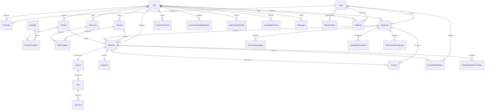

## 📊 Visual Entity Groups

### **1. Identity & Access Management**

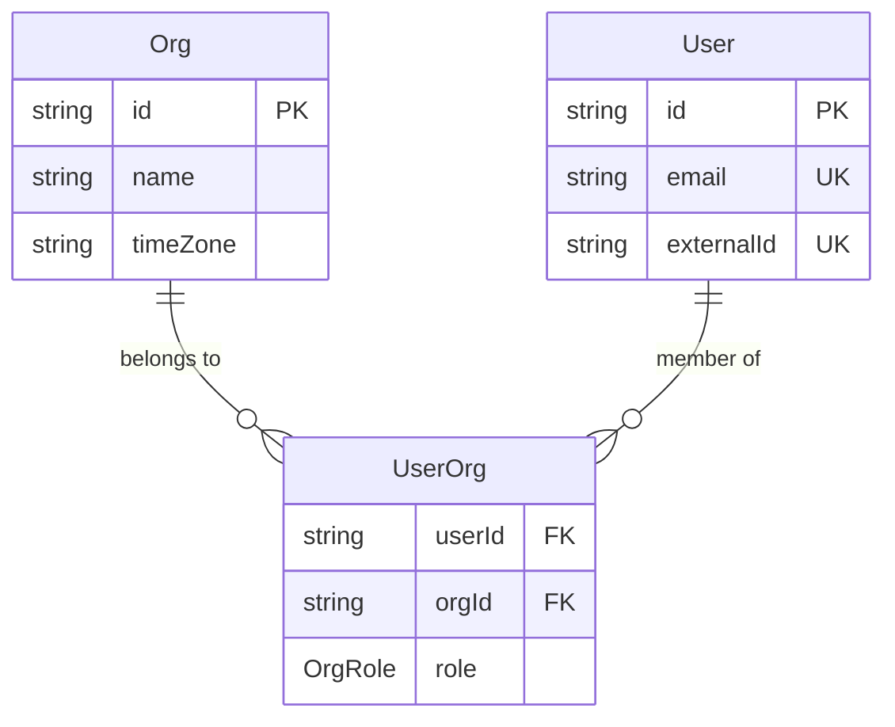

### **2. People Management**

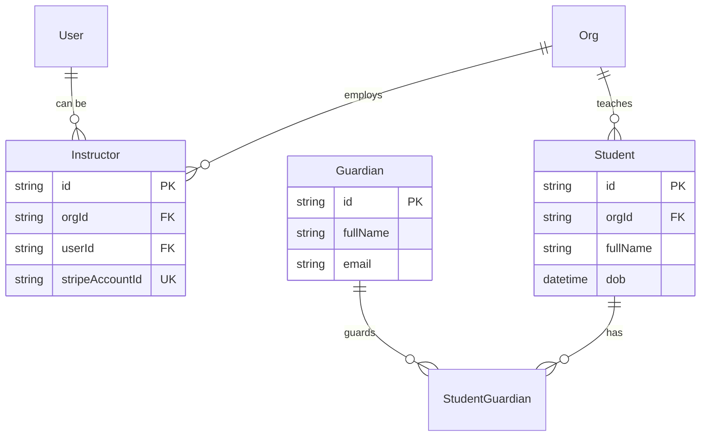

### **3. Service Catalog & Pricing**

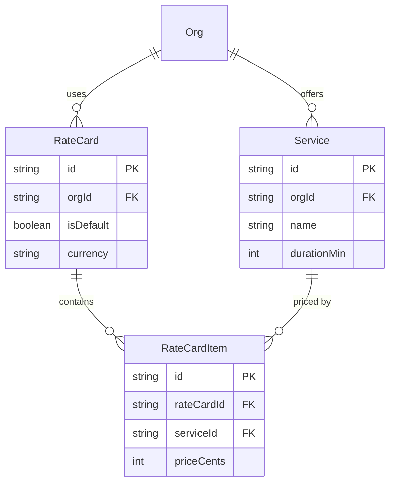

### **4. Scheduling & Booking**

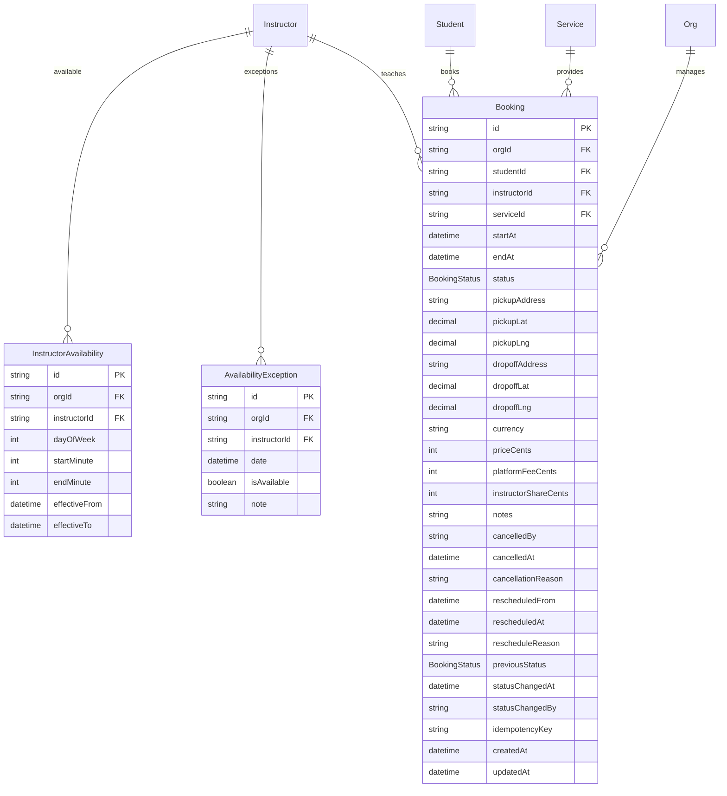

### **5. Lesson Execution & GPS**

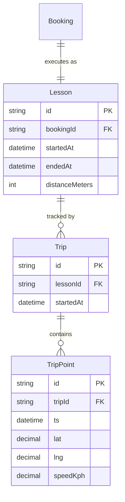

### **6. Financial Operations**

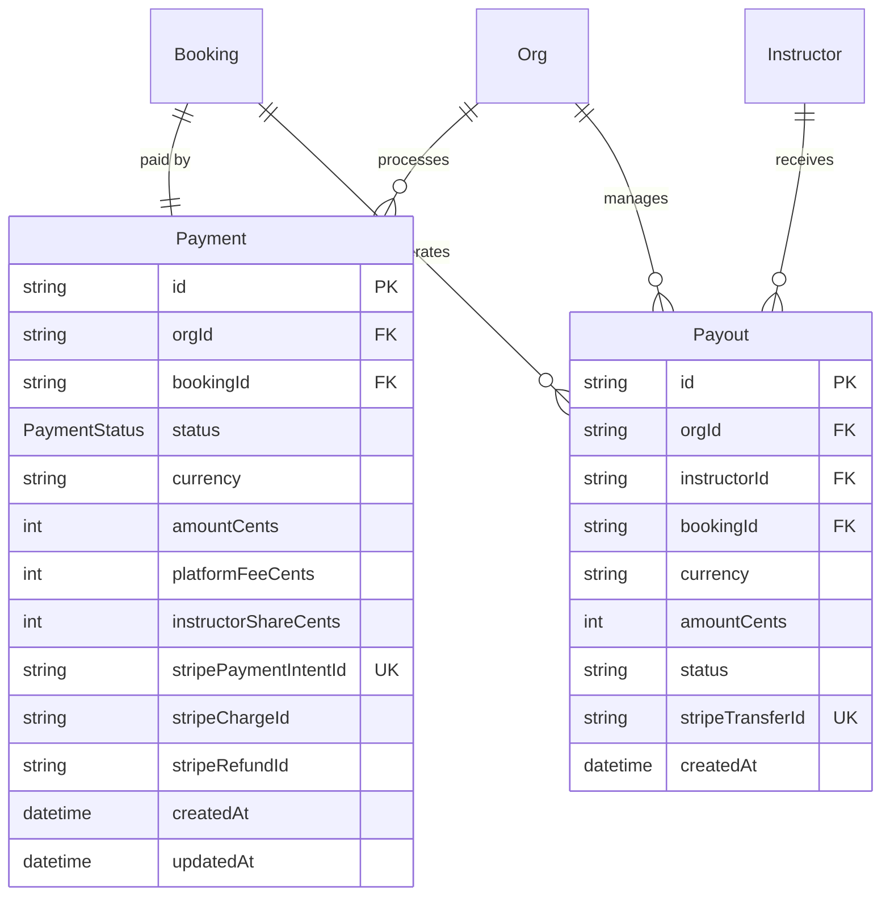

### **7. Authentication & Security**

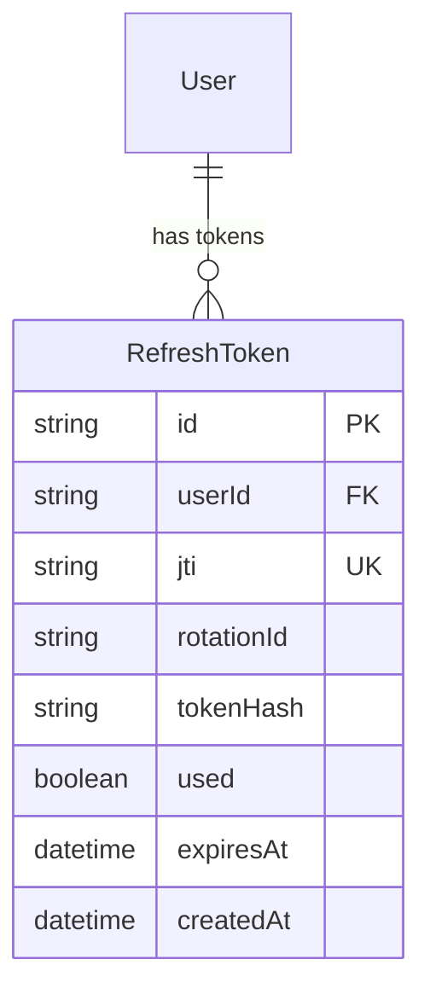

### **8. System Events & Integration**

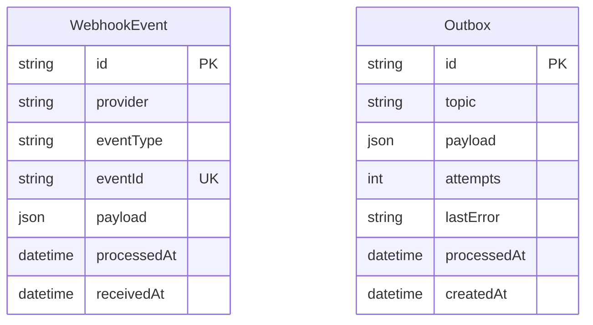

## 🔗 Detailed Relationship Mappings

### **One-to-One Relationships**

| **Parent** | **Child** | **Description**                     | **Foreign Key**     |
| ---------- | --------- | ----------------------------------- | ------------------- |
| `Booking`  | `Lesson`  | Each booking executes as one lesson | `Lesson.bookingId`  |
| `Booking`  | `Payment` | Each booking has one payment        | `Payment.bookingId` |

### **One-to-Many Relationships**

| **Parent**   | **Child**            | **Description**                      | **Foreign Key**        |
| ------------ | -------------------- | ------------------------------------ | ---------------------- |
| `Org`        | `User` (via UserOrg) | Organization has many users          | `UserOrg.orgId`        |
| `Org`        | `Instructor`         | Organization employs instructors     | `Instructor.orgId`     |
| `Org`        | `Student`            | Organization teaches students        | `Student.orgId`        |
| `Org`        | `Service`            | Organization offers services         | `Service.orgId`        |
| `Org`        | `RateCard`           | Organization uses rate cards         | `RateCard.orgId`       |
| `Org`        | `Booking`            | Organization manages bookings        | `Booking.orgId`        |
| `Student`    | `Booking`            | Student makes multiple bookings      | `Booking.studentId`    |
| `Instructor` | `Booking`            | Instructor teaches multiple lessons  | `Booking.instructorId` |
| `Service`    | `Booking`            | Service used in multiple bookings    | `Booking.serviceId`    |
| `Lesson`     | `Trip`               | Lesson can have multiple GPS trips   | `Trip.lessonId`        |
| `Trip`       | `TripPoint`          | Trip contains many GPS points        | `TripPoint.tripId`     |
| `Instructor` | `Payout`             | Instructor receives multiple payouts | `Payout.instructorId`  |

### **Many-to-Many Relationships**

| **Entity A** | **Entity B** | **Junction Table** | **Description**                                        |
| ------------ | ------------ | ------------------ | ------------------------------------------------------ |
| `User`       | `Org`        | `UserOrg`          | Users can belong to multiple orgs with different roles |
| `Student`    | `Guardian`   | `StudentGuardian`  | Students can have multiple guardians                   |
| `RateCard`   | `Service`    | `RateCardItem`     | Rate cards price multiple services                     |

### **Optional Relationships**

| **Parent** | **Child**    | **Field**           | **Use Case**                                   |
| ---------- | ------------ | ------------------- | ---------------------------------------------- |
| `User`     | `Instructor` | `Instructor.userId` | Instructors may or may not have login accounts |
| `Booking`  | `Payout`     | `Payout.bookingId`  | Payouts can be booking-specific or bulk        |

## 🎯 Key Relationship Patterns

### **Multi-Tenancy Enforcement**

Every tenant-scoped entity includes `orgId`:

- Always filter by `orgId` in queries
- Never allow cross-tenant data access
- Use repository pattern to enforce scoping

### **Referential Integrity Rules**

#### **Cascade Deletes** (Data cleanup)

- `Org` deletion cascades to all org-owned entities
- `User` deletion cascades to `UserOrg` memberships
- `Booking` deletion cascades to `Lesson`, `Payment`, `Payout`

#### **Restrict Deletes** (Data protection)

- Cannot delete `Student` with active bookings
- Cannot delete `Instructor` with active lessons
- Cannot delete `Service` with bookings

#### **Set Null** (Soft references)

- `Instructor.userId` set to null if User deleted
- `AuditLog.actorUserId` set to null if User deleted

### **Indexing for Relationships**

#### **Foreign Key Indexes**

```sql
-- Multi-tenant queries
CREATE INDEX idx_booking_org_start ON Booking(orgId, startAt);
CREATE INDEX idx_payment_org_status ON Payment(orgId, status);

-- User activity
CREATE INDEX idx_booking_instructor_start ON Booking(instructorId, startAt);
CREATE INDEX idx_booking_student_start ON Booking(studentId, startAt);

-- GPS tracking
CREATE INDEX idx_trip_point_trip_ts ON TripPoint(tripId, ts);
```

#### **Unique Constraints**

```sql
-- Business rules
UNIQUE(userId, orgId, role) -- User can have one role per org
UNIQUE(studentId, guardianId) -- Guardian relationship uniqueness
UNIQUE(rateCardId, serviceId) -- Service priced once per rate card
UNIQUE(instructorId, date) -- Availability exception uniqueness

-- External system integration
UNIQUE(stripePaymentIntentId) -- Stripe payment deduplication
UNIQUE(stripeAccountId) -- Instructor payout account uniqueness
```

## 🔍 Query Patterns

### **Common Join Patterns**

#### **Booking with All Details**

```sql
SELECT b.*, s.fullName as studentName, i.displayName as instructorName, sv.name as serviceName
FROM Booking b
JOIN Student s ON b.studentId = s.id
JOIN Instructor i ON b.instructorId = i.id
JOIN Service sv ON b.serviceId = sv.id
WHERE b.orgId = $1
```

#### **Student Progress Report**

```sql
SELECT s.fullName, COUNT(l.id) as completedLessons, AVG(l.rating) as avgRating
FROM Student s
LEFT JOIN Booking b ON s.id = b.studentId
LEFT JOIN Lesson l ON b.id = l.bookingId
WHERE s.orgId = $1 AND l.endedAt IS NOT NULL
GROUP BY s.id, s.fullName
```

#### **Instructor Revenue Report**

```sql
SELECT i.displayName, SUM(p.amountCents) as totalEarnings
FROM Instructor i
JOIN Payout p ON i.id = p.instructorId
WHERE i.orgId = $1 AND p.status = 'paid'
GROUP BY i.id, i.displayName
```

### **Relationship Validation Queries**

#### **Orphaned Records Check**

```sql
-- Find bookings without lessons (never started)
SELECT b.id FROM Booking b
LEFT JOIN Lesson l ON b.id = l.bookingId
WHERE l.id IS NULL AND b.status = 'completed'

-- Find lessons without GPS tracking
SELECT l.id FROM Lesson l
LEFT JOIN Trip t ON l.id = t.lessonId
WHERE t.id IS NULL AND l.endedAt IS NOT NULL
```

---

## 7. Advanced State Management System

### **State Transition Engine**

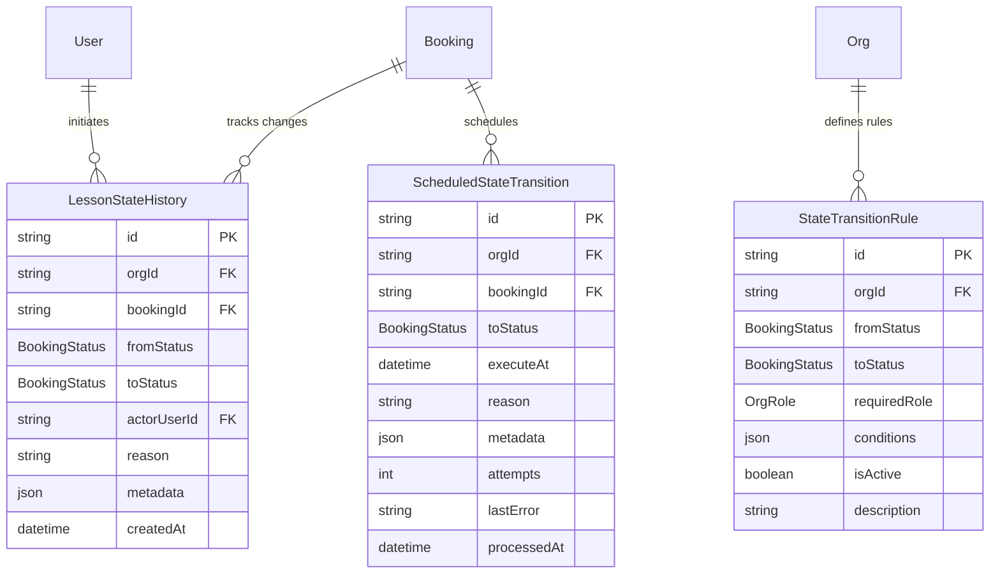

### **State Management Relationships**

| **Parent** | **Child**                  | **Description**                             | **Foreign Key**                      |
| ---------- | -------------------------- | ------------------------------------------- | ------------------------------------ |
| `Booking`  | `LessonStateHistory`       | Complete audit trail of status changes      | `LessonStateHistory.bookingId`       |
| `Booking`  | `ScheduledStateTransition` | Background state changes (NoShow, timeout)  | `ScheduledStateTransition.bookingId` |
| `Org`      | `StateTransitionRule`      | Configurable business rules for transitions | `StateTransitionRule.orgId`          |
| `User`     | `LessonStateHistory`       | Actor who initiated state change            | `LessonStateHistory.actorUserId`     |

---

## 8. Enhanced Availability System

### **Sophisticated Availability Management**

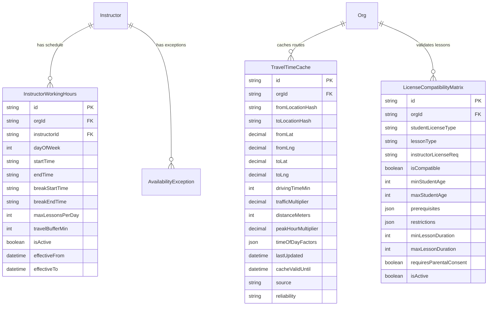

### **Enhanced Availability Relationships**

| **Parent**   | **Child**                    | **Description**                               | **Foreign Key**                       |
| ------------ | ---------------------------- | --------------------------------------------- | ------------------------------------- |
| `Instructor` | `InstructorWorkingHours`     | Detailed schedule with breaks and buffers     | `InstructorWorkingHours.instructorId` |
| `Org`        | `TravelTimeCache`            | Pre-calculated travel times between locations | `TravelTimeCache.orgId`               |
| `Org`        | `LicenseCompatibilityMatrix` | License type validation rules                 | `LicenseCompatibilityMatrix.orgId`    |

---

## 9. Policy Engine System

### **Cancellation & Business Rules**

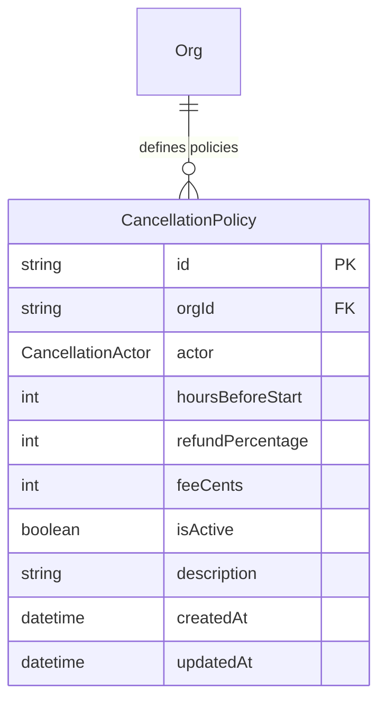

### **Policy Engine Relationships**

| **Parent** | **Child**            | **Description**                         | **Foreign Key**            |
| ---------- | -------------------- | --------------------------------------- | -------------------------- |
| `Org`      | `CancellationPolicy` | Actor-based cancellation rules and fees | `CancellationPolicy.orgId` |

### **Cancellation Actor Types**

- **`student`**: Student-initiated cancellations
- **`parent`**: Parent/guardian cancellations
- **`instructor`**: Instructor cancellations
- **`admin`**: Administrative cancellations

---

## 10. Messaging & Events System

### **Communication & Event Processing**

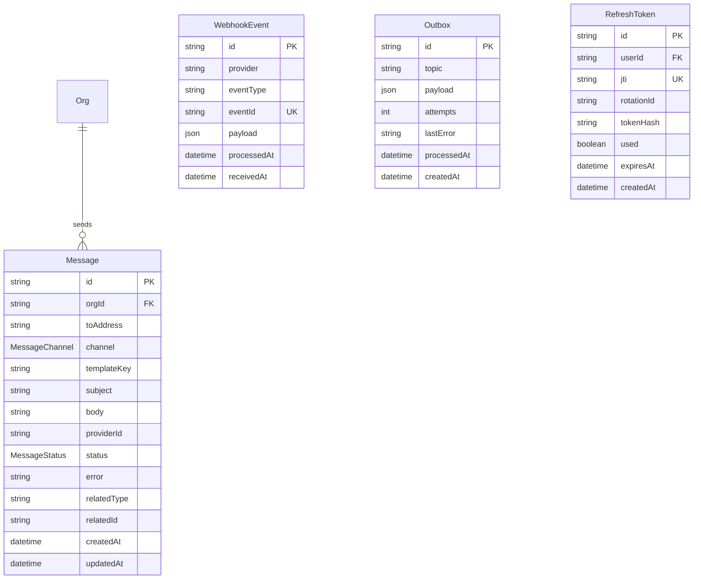

### **Messaging & Events Relationships**

| **Parent** | **Child**      | **Description**                              | **Foreign Key**       |
| ---------- | -------------- | -------------------------------------------- | --------------------- |
| `Org`      | `Message`      | Email/SMS notifications sent by organization | `Message.orgId`       |
| `User`     | `RefreshToken` | JWT refresh tokens for authentication        | `RefreshToken.userId` |

### **Message Channel Types**

- **`email`**: Email notifications
- **`sms`**: SMS text messages
- **`whatsapp`**: WhatsApp messages

### **Event Processing**

- **`WebhookEvent`**: Inbound webhooks (Stripe, etc.)
- **`Outbox`**: Outbound events with retry logic
- **`RefreshToken`**: Secure token rotation system

---

## 🔗 Updated Complete Relationship Mappings

### **One-to-One Relationships**

| **Parent** | **Child** | **Description**                     | **Foreign Key**     |
| ---------- | --------- | ----------------------------------- | ------------------- |
| `Booking`  | `Lesson`  | Each booking executes as one lesson | `Lesson.bookingId`  |
| `Booking`  | `Payment` | Each booking has one payment        | `Payment.bookingId` |

### **One-to-Many Relationships**

| **Parent**   | **Child**                    | **Description**                      | **Foreign Key**                       |
| ------------ | ---------------------------- | ------------------------------------ | ------------------------------------- |
| `Org`        | `User` (via UserOrg)         | Organization has many users          | `UserOrg.orgId`                       |
| `Org`        | `Instructor`                 | Organization employs instructors     | `Instructor.orgId`                    |
| `Org`        | `Student`                    | Organization teaches students        | `Student.orgId`                       |
| `Org`        | `Service`                    | Organization offers services         | `Service.orgId`                       |
| `Org`        | `RateCard`                   | Organization uses rate cards         | `RateCard.orgId`                      |
| `Org`        | `Booking`                    | Organization manages bookings        | `Booking.orgId`                       |
| `Org`        | `Message`                    | Organization sends notifications     | `Message.orgId`                       |
| `Org`        | `CancellationPolicy`         | Organization defines policies        | `CancellationPolicy.orgId`            |
| `Org`        | `TravelTimeCache`            | Organization caches travel data      | `TravelTimeCache.orgId`               |
| `Org`        | `LicenseCompatibilityMatrix` | Organization validates licenses      | `LicenseCompatibilityMatrix.orgId`    |
| `Student`    | `Booking`                    | Student makes multiple bookings      | `Booking.studentId`                   |
| `Instructor` | `Booking`                    | Instructor teaches multiple lessons  | `Booking.instructorId`                |
| `Instructor` | `InstructorWorkingHours`     | Instructor has detailed schedule     | `InstructorWorkingHours.instructorId` |
| `Service`    | `Booking`                    | Service used in multiple bookings    | `Booking.serviceId`                   |
| `Lesson`     | `Trip`                       | Lesson can have multiple GPS trips   | `Trip.lessonId`                       |
| `Trip`       | `TripPoint`                  | Trip contains many GPS points        | `TripPoint.tripId`                    |
| `Instructor` | `Payout`                     | Instructor receives multiple payouts | `Payout.instructorId`                 |
| `Booking`    | `LessonStateHistory`         | Booking has complete audit trail     | `LessonStateHistory.bookingId`        |
| `Booking`    | `ScheduledStateTransition`   | Booking has scheduled transitions    | `ScheduledStateTransition.bookingId`  |
| `User`       | `RefreshToken`               | User has multiple refresh tokens     | `RefreshToken.userId`                 |

### **Many-to-Many Relationships**

| **Entity A** | **Entity B** | **Junction Table** | **Description**                                        |
| ------------ | ------------ | ------------------ | ------------------------------------------------------ |
| `User`       | `Org`        | `UserOrg`          | Users can belong to multiple orgs with different roles |
| `Student`    | `Guardian`   | `StudentGuardian`  | Students can have multiple guardians                   |
| `RateCard`   | `Service`    | `RateCardItem`     | Rate cards price multiple services                     |

### **Optional Relationships**

| **Parent** | **Child**            | **Field**                        | **Use Case**                                   |
| ---------- | -------------------- | -------------------------------- | ---------------------------------------------- |
| `User`     | `Instructor`         | `Instructor.userId`              | Instructors may or may not have login accounts |
| `Booking`  | `Payout`             | `Payout.bookingId`               | Payouts can be booking-specific or bulk        |
| `User`     | `LessonStateHistory` | `LessonStateHistory.actorUserId` | System changes have no actor                   |
| `User`     | `AuditLog`           | `AuditLog.actorUserId`           | System actions have no actor                   |

This comprehensive relationship structure ensures **data integrity**, **performance**, **multi-tenant security**, and **advanced business logic** throughout the DriveFlow platform.
