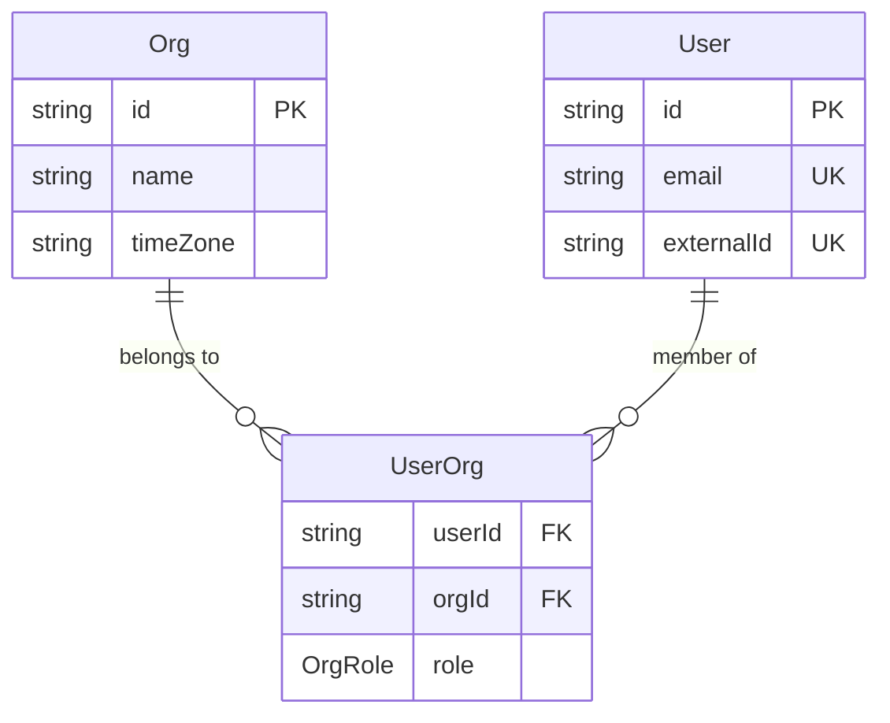
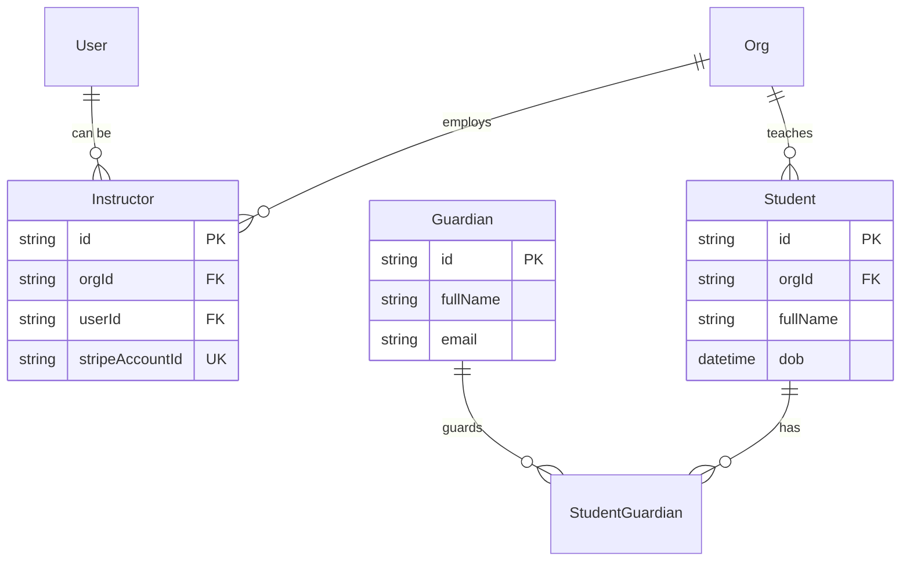
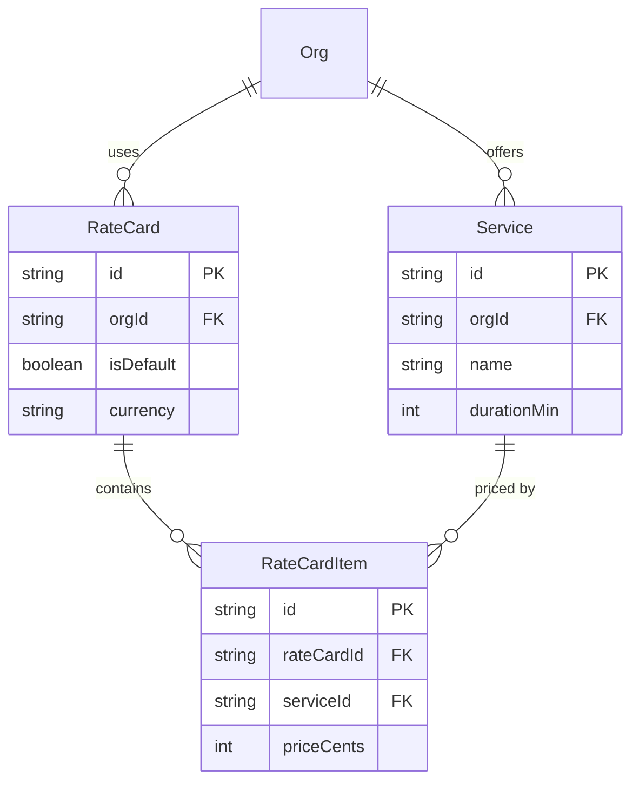
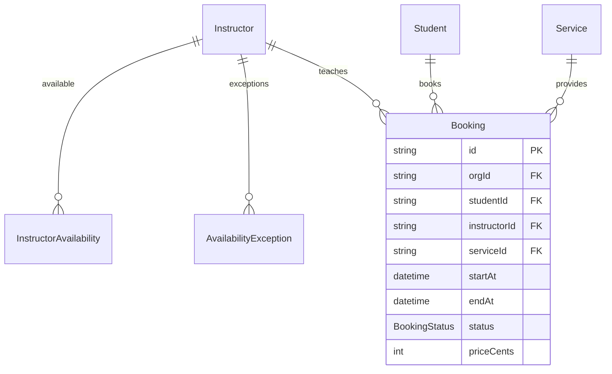
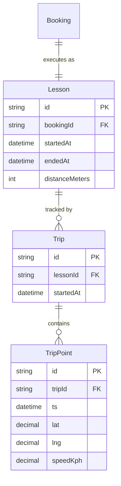
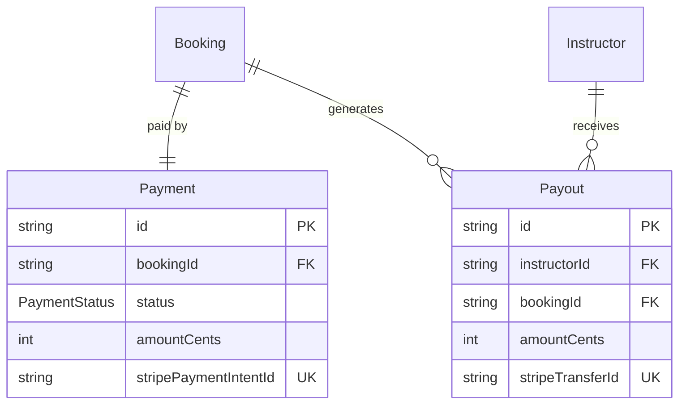

# Entity Relationship Diagram & Mappings

## 🗺️ Complete Entity Relationship Overview

This document provides detailed relationship mappings for all entities in the DriveFlow schema.

## 📊 Visual Entity Groups

### **1. Identity & Access Management**



### **2. People Management**



### **3. Service Catalog & Pricing**



### **4. Scheduling & Booking**



### **5. Lesson Execution & GPS**



### **6. Financial Operations**



## 🔗 Detailed Relationship Mappings

### **One-to-One Relationships**

| **Parent** | **Child** | **Description** | **Foreign Key** |
|------------|-----------|-----------------|----------------|
| `Booking` | `Lesson` | Each booking executes as one lesson | `Lesson.bookingId` |
| `Booking` | `Payment` | Each booking has one payment | `Payment.bookingId` |

### **One-to-Many Relationships**

| **Parent** | **Child** | **Description** | **Foreign Key** |
|------------|-----------|-----------------|----------------|
| `Org` | `User` (via UserOrg) | Organization has many users | `UserOrg.orgId` |
| `Org` | `Instructor` | Organization employs instructors | `Instructor.orgId` |
| `Org` | `Student` | Organization teaches students | `Student.orgId` |
| `Org` | `Service` | Organization offers services | `Service.orgId` |
| `Org` | `RateCard` | Organization uses rate cards | `RateCard.orgId` |
| `Org` | `Booking` | Organization manages bookings | `Booking.orgId` |
| `Student` | `Booking` | Student makes multiple bookings | `Booking.studentId` |
| `Instructor` | `Booking` | Instructor teaches multiple lessons | `Booking.instructorId` |
| `Service` | `Booking` | Service used in multiple bookings | `Booking.serviceId` |
| `Lesson` | `Trip` | Lesson can have multiple GPS trips | `Trip.lessonId` |
| `Trip` | `TripPoint` | Trip contains many GPS points | `TripPoint.tripId` |
| `Instructor` | `Payout` | Instructor receives multiple payouts | `Payout.instructorId` |

### **Many-to-Many Relationships**

| **Entity A** | **Entity B** | **Junction Table** | **Description** |
|--------------|--------------|-------------------|-----------------|
| `User` | `Org` | `UserOrg` | Users can belong to multiple orgs with different roles |
| `Student` | `Guardian` | `StudentGuardian` | Students can have multiple guardians |
| `RateCard` | `Service` | `RateCardItem` | Rate cards price multiple services |

### **Optional Relationships**

| **Parent** | **Child** | **Field** | **Use Case** |
|------------|-----------|-----------|--------------|
| `User` | `Instructor` | `Instructor.userId` | Instructors may or may not have login accounts |
| `Booking` | `Payout` | `Payout.bookingId` | Payouts can be booking-specific or bulk |

## 🎯 Key Relationship Patterns

### **Multi-Tenancy Enforcement**
Every tenant-scoped entity includes `orgId`:
- Always filter by `orgId` in queries
- Never allow cross-tenant data access
- Use repository pattern to enforce scoping

### **Referential Integrity Rules**

#### **Cascade Deletes** (Data cleanup)
- `Org` deletion cascades to all org-owned entities
- `User` deletion cascades to `UserOrg` memberships
- `Booking` deletion cascades to `Lesson`, `Payment`, `Payout`

#### **Restrict Deletes** (Data protection)
- Cannot delete `Student` with active bookings
- Cannot delete `Instructor` with active lessons
- Cannot delete `Service` with bookings

#### **Set Null** (Soft references)
- `Instructor.userId` set to null if User deleted
- `AuditLog.actorUserId` set to null if User deleted

### **Indexing for Relationships**

#### **Foreign Key Indexes**
```sql
-- Multi-tenant queries
CREATE INDEX idx_booking_org_start ON Booking(orgId, startAt);
CREATE INDEX idx_payment_org_status ON Payment(orgId, status);

-- User activity
CREATE INDEX idx_booking_instructor_start ON Booking(instructorId, startAt);
CREATE INDEX idx_booking_student_start ON Booking(studentId, startAt);

-- GPS tracking
CREATE INDEX idx_trip_point_trip_ts ON TripPoint(tripId, ts);
```

#### **Unique Constraints**
```sql
-- Business rules
UNIQUE(userId, orgId, role) -- User can have one role per org
UNIQUE(studentId, guardianId) -- Guardian relationship uniqueness
UNIQUE(rateCardId, serviceId) -- Service priced once per rate card
UNIQUE(instructorId, date) -- Availability exception uniqueness

-- External system integration
UNIQUE(stripePaymentIntentId) -- Stripe payment deduplication
UNIQUE(stripeAccountId) -- Instructor payout account uniqueness
```

## 🔍 Query Patterns

### **Common Join Patterns**

#### **Booking with All Details**
```sql
SELECT b.*, s.fullName as studentName, i.displayName as instructorName, sv.name as serviceName
FROM Booking b
JOIN Student s ON b.studentId = s.id
JOIN Instructor i ON b.instructorId = i.id  
JOIN Service sv ON b.serviceId = sv.id
WHERE b.orgId = $1
```

#### **Student Progress Report**
```sql
SELECT s.fullName, COUNT(l.id) as completedLessons, AVG(l.rating) as avgRating
FROM Student s
LEFT JOIN Booking b ON s.id = b.studentId
LEFT JOIN Lesson l ON b.id = l.bookingId
WHERE s.orgId = $1 AND l.endedAt IS NOT NULL
GROUP BY s.id, s.fullName
```

#### **Instructor Revenue Report**
```sql
SELECT i.displayName, SUM(p.amountCents) as totalEarnings
FROM Instructor i
JOIN Payout p ON i.id = p.instructorId
WHERE i.orgId = $1 AND p.status = 'paid'
GROUP BY i.id, i.displayName
```

### **Relationship Validation Queries**

#### **Orphaned Records Check**
```sql
-- Find bookings without lessons (never started)
SELECT b.id FROM Booking b 
LEFT JOIN Lesson l ON b.id = l.bookingId 
WHERE l.id IS NULL AND b.status = 'completed'

-- Find lessons without GPS tracking
SELECT l.id FROM Lesson l
LEFT JOIN Trip t ON l.id = t.lessonId
WHERE t.id IS NULL AND l.endedAt IS NOT NULL
```

This relationship structure ensures **data integrity**, **performance**, and **multi-tenant security** throughout the DriveFlow platform.
