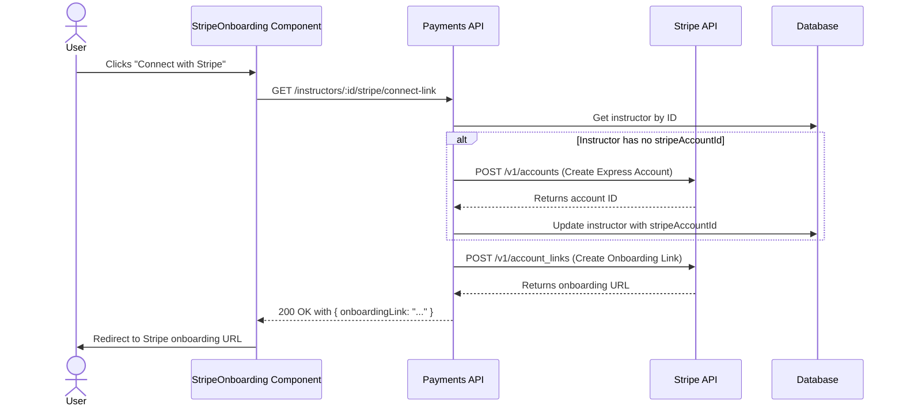
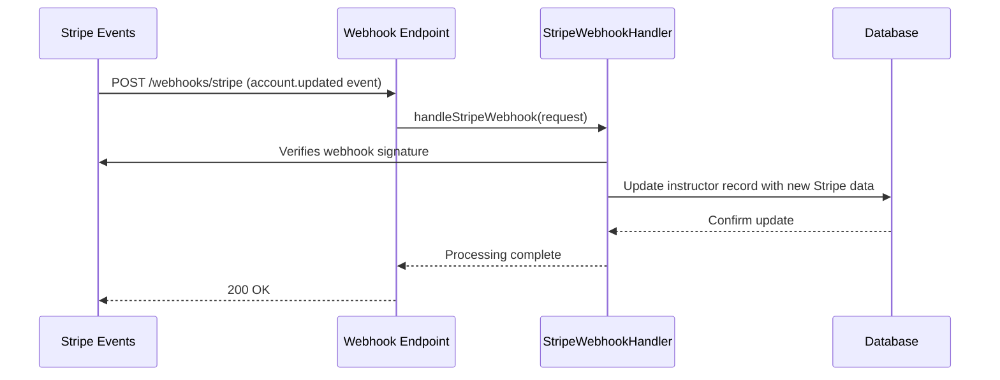

# Stripe Onboarding for Instructors

This document outlines the architecture and implementation of the Stripe Connect onboarding feature for instructors in DriveFlow.

## 1. Feature Overview

The goal of this feature is to allow driving school instructors to connect their bank accounts to the DriveFlow platform via Stripe Connect Express. This enables them to receive payouts for the lessons they conduct. The process is designed to be secure, compliant, and user-friendly.

### Key Components:
- **Backend API**: A set of NestJS endpoints to manage Stripe accounts, generate onboarding links, and handle webhooks.
- **Frontend UI**: A React component within the web application for instructors to manage their Stripe connection.
- **Database**: New fields on the `Instructor` model to store Stripe-related IDs and status information.
- **Contracts**: Shared Zod schemas for type-safe data exchange between the frontend and backend.

## 2. Backend Implementation (`apps/api`)

The core of the backend logic resides in the new `PaymentsModule`.

### 2.1. `PaymentsModule`
- **Path**: `apps/api/src/modules/payments/payments.module.ts`
- **Responsibilities**:
  - Encapsulates all payment-related components (`controller`, `service`, `repository`).
  - Provides the `Stripe` client instance, configured with the secret key from environment variables.
  - Injects the `StripeWebhookHandler`.

### 2.2. `PaymentsController`
- **Path**: `apps/api/src/modules/payments/payments.controller.ts`
- **Endpoints**:
  - `GET /instructors/:id/stripe/connect-link`:
    - **Description**: Generates a one-time Stripe Connect onboarding link for an instructor. If the instructor does not have a Stripe account, one is created first.
    - **Authorization**: `admin` role required.
  - `GET /instructors/:id/payout-readiness`:
    - **Description**: Retrieves the current status of an instructor's Stripe account, including any outstanding requirements.
    - **Authorization**: `admin` or `instructor` role required.
  - `POST /webhooks/stripe`:
    - **Description**: A public endpoint to receive webhook events from Stripe. It uses the `StripeWebhookHandler` to process these events.
    - **Security**: Verifies the Stripe signature of incoming requests.

### 2.3. `PaymentsService`
- **Path**: `apps/api/src/modules/payments/payments.service.ts`
- **Core Logic**:
  - `ensureExpressAccountAndLink`:
    1. Fetches the instructor and their associated user data.
    2. If no `stripeAccountId` exists, it calls the Stripe API to create a new Express account.
    3. Stores the new `stripeAccountId` in the database.
    4. Creates and returns a new `account_link` for the onboarding flow.
  - `getStripeAccountStatus`:
    1. Fetches the instructor's Stripe account from the Stripe API.
    2. Determines the payout readiness status (`Not Started`, `Pending`, `Restricted`, `Complete`) based on the account's `requirements`, `charges_enabled`, and `details_submitted` fields.
    3. Returns the status and a list of outstanding requirements.

### 2.4. `StripeWebhookHandler`
- **Path**: `apps/api/src/modules/payments/webhooks/stripe.webhook.ts`
- **Responsibilities**:
  - Verifies the `stripe-signature` header of incoming webhook requests to ensure they are from Stripe.
  - Handles the `account.updated` event to keep the instructor's status in the DriveFlow database synchronized with Stripe.

## 3. Frontend Implementation (`apps/web`)

A new Next.js application was initialized to house the frontend components.

### 3.1. `StripeOnboarding` Component
- **Path**: `apps/web/src/components/instructors/StripeOnboarding.tsx`
- **Functionality**:
  - A client component (`'use client'`) that fetches the instructor's payout readiness status from the API on mount.
  - Displays the current status: `Not Started`, `Pending`, `Restricted`, or `Complete`.
  - If the status is `Pending` or `Restricted`, it lists the outstanding requirements returned from the API.
  - Provides a "Connect with Stripe" button. When clicked, it fetches a new onboarding link from the API and redirects the user to Stripe.

### 3.2. Payouts Page
- **Path**: `apps/web/src/app/dashboard/instructors/[id]/payouts/page.tsx`
- **Description**: A Next.js page that renders the `StripeOnboarding` component, passing the `instructorId` from the URL.

## 4. Database Schema (`schema.prisma`)

The `Instructor` model was modified to include the following fields:

- `stripeAccountId`: Stores the Stripe Connect account ID (`acct_...`).
- `stripeOnboardingStatus`: The status of the onboarding process.
- `stripeCapabilities`: The capabilities of the Stripe account (e.g., `card_payments`, `transfers`).
- `stripeRequirementsDue`: Any outstanding requirements from Stripe.
- `stripeConnectedAt`: Timestamp of when the account was successfully connected.
- `stripeDisconnectedAt`: Timestamp of when the account was disconnected.

## 5. Data Contracts (`packages/contracts`)

To ensure type safety, new Zod schemas were created in `packages/contracts/src/payments/stripe.schemas.ts`:

- `StripeAccountStatusDto`: Defines the shape of the data returned by the `/payout-readiness` endpoint.
- `PayoutReadinessStatus`: An enum for the possible status values.
- `StripeConnectLinkDto`: Defines the shape of the data returned by the `/stripe/connect-link` endpoint.

## 6. Sequence Diagrams

### Onboarding Flow

### Webhook Sync Flow

