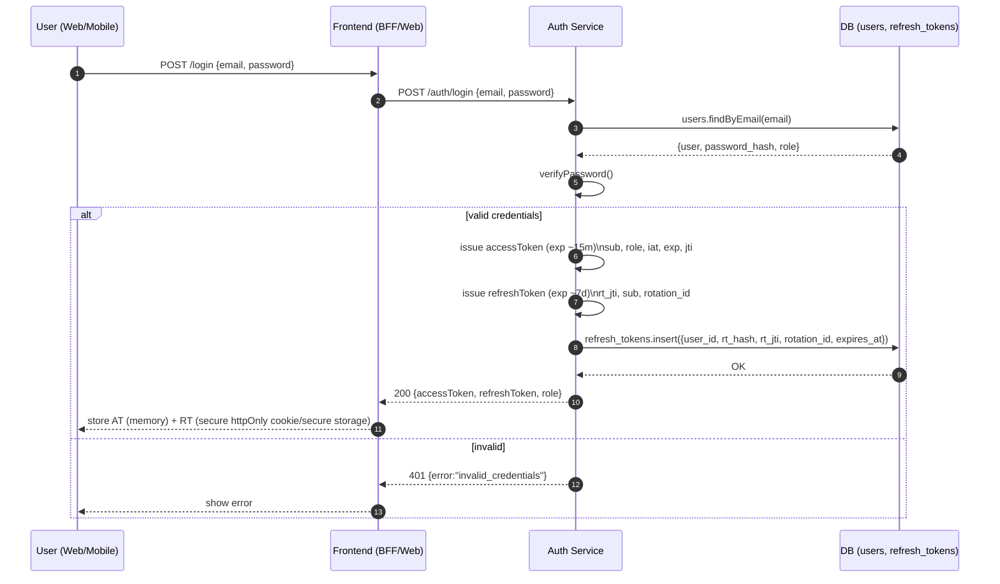
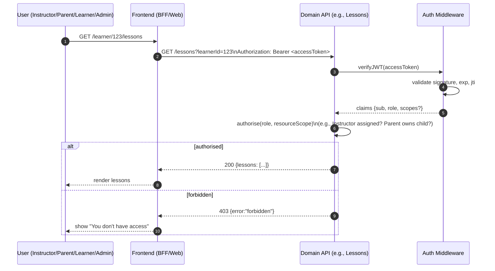
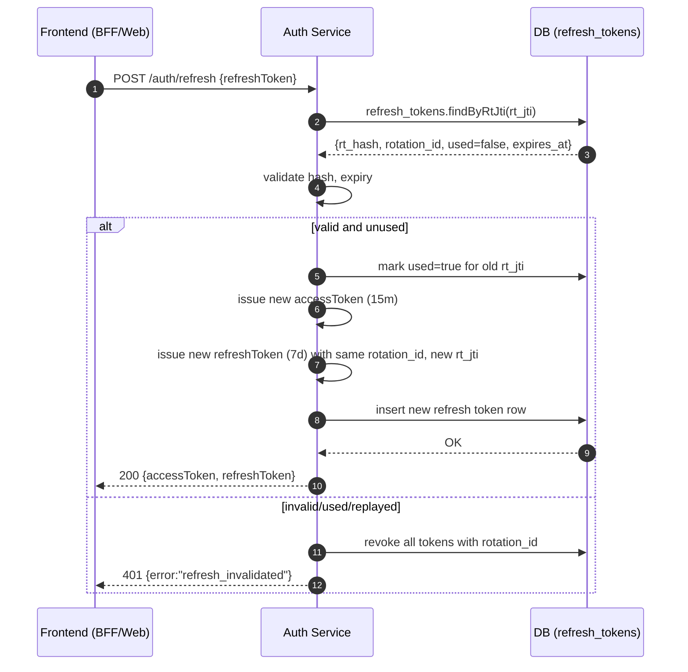
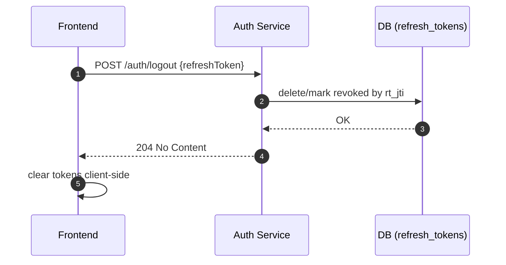

# Product Requirements Document (PRD)

**Feature**: JWT Authentication & Role-Based Permissions

**Project**: DriveFlow MVP

**Date**: 10 Aug 2025

**Author**: DriveFlow Team

---

## 1. Overview

DriveFlow requires a secure, scalable authentication and authorisation system to manage access for **four user roles**:

- **Instructor** – Delivers driving lessons, manages schedules, views assigned learners.
- **Parent** – Pays for lessons, views learner progress & lesson history.
- **Learner** – Books lessons, views own lesson history and progress.
- **Admin** – Manages the platform, oversees all users, payments, and settings.

We will implement **JWT-based authentication** for stateless API access and **role-based permissions** to control access to resources at both the API and UI level.

---

## 2. Goals & Objectives

- **Secure Login & Token Management** – Stateless JWT-based authentication with refresh tokens.
- **Role-Based Permissions** – Granular control for the 4 roles.
- **Easy Integration** – Designed to plug into future mobile and web apps without major rewrites.
- **Compliance & Auditability** – Logging for security events.

---

## 3. Assumptions

- Backend is microservices-based (API Gateway + service-specific APIs).
- Database: PostgreSQL (with `users` and `roles` tables).
- JWT secret keys will be stored securely in environment variables.
- OAuth or social logins **not** part of MVP (future enhancement possible).

---

## 4. User Roles & Permissions Matrix

| Action / Resource                  | Instructor                    | Parent                | Learner   | Admin |
| ---------------------------------- | ----------------------------- | --------------------- | --------- | ----- |
| **Authentication**                 | ✅                            | ✅                    | ✅        | ✅    |
| **View own profile**               | ✅                            | ✅                    | ✅        | ✅    |
| **Edit own profile**               | ✅                            | ✅                    | ✅        | ✅    |
| **View learner profiles**          | ✅ (assigned only)            | ✅ (their child only) | ❌        | ✅    |
| **View lesson history**            | ✅ (assigned learners)        | ✅ (child)            | ✅ (self) | ✅    |
| **Create/Update lessons**          | ✅ (assigned only)            | ❌                    | ❌        | ✅    |
| **Book lessons**                   | ❌                            | ✅ (for child)        | ✅ (self) | ✅    |
| **Cancel lessons**                 | ✅ (assigned)                 | ✅ (child)            | ✅ (self) | ✅    |
| **View payments**                  | ✅ (related to their lessons) | ✅ (child's payments) | ❌        | ✅    |
| **Manage payments/refunds**        | ❌                            | ✅                    | ❌        | ✅    |
| **Manage platform settings/users** | ❌                            | ❌                    | ❌        | ✅    |

---

## 5. Functional Requirements

### 5.1 Authentication

- **POST /auth/login**
  - Input: `{ email, password }`
  - Output: `{ accessToken, refreshToken, userRole }`
  - Validates credentials, issues **short-lived access token (e.g., 15 min)** and **long-lived refresh token (e.g., 7 days)**.
- **POST /auth/refresh**
  - Input: `{ refreshToken }`
  - Output: `{ accessToken }`
  - Rotates refresh tokens to prevent replay attacks.
- **POST /auth/logout**
  - Invalidates refresh token in DB (blacklist/expiry).

### 5.2 JWT Token Structure

- **Header**: `{ alg: "HS256", typ: "JWT" }`
- **Payload Claims**:
  - `sub`: User ID
  - `role`: "instructor" | "parent" | "learner" | "admin"
  - `iat`, `exp`: issued at / expiry
  - (Optional) `permissions`: explicit permission list
- **Signature**: HMAC SHA-256 with secret.

### 5.3 Role-Based Authorisation Middleware

- Middleware reads `role` from JWT payload.
- Checks against **permission map** (see matrix in section 4).
- Returns `403 Forbidden` if not authorised.
- Example:

```javascript
const can = (requiredRole) => (req, res, next) => {
  if (req.user.role !== requiredRole) {
    return res.status(403).json({ message: "Forbidden" });
  }
  next();
};
```

- Future: Support multi-role or granular resource-based permissions.

### 5.4 User & Role Management APIs

- **GET /users/me** – Get own profile.
- **PATCH /users/me** – Update own profile.
- **GET /users/:id** – Admin-only (except scoped access for Instructor/Parent).
- **PATCH /users/:id** – Admin-only.

---

## 6. Non-Functional Requirements

- **Security**
  - Store hashed passwords (bcrypt, min cost factor 10).
  - Use HTTPS for all API traffic.
  - Rotate JWT secret keys periodically.
- **Performance**
  - Token verification in < 50ms.
- **Scalability**
  - Stateless auth → can scale horizontally.
- **Audit Logs**
  - Log failed logins, password resets, permission denials.

---

## 7. Error Handling

- 401 – Missing or invalid JWT.
- 403 – Valid JWT but insufficient permissions.
- 400 – Invalid request format.
- 500 – Internal server error (log for debugging).

---

## 8. Data Model

**users table**

| Field      | Type     | Notes                              |
| ---------- | -------- | ---------------------------------- |
| id         | UUID     | Primary key                        |
| email      | String   | Unique                             |
| password   | String   | Hashed                             |
| role       | Enum     | instructor, parent, learner, admin |
| created_at | DateTime |                                    |
| updated_at | DateTime |                                    |

**refresh_tokens table**

| Field      | Type     | Notes         |
| ---------- | -------- | ------------- |
| id         | UUID     | Primary key   |
| user_id    | UUID     | FK to users   |
| token      | String   | Stored hashed |
| expires_at | DateTime |               |
| created_at | DateTime |               |

---

## 9. Open Questions

- Will Parents and Learners share a login if the Learner is a minor? (Impacts role handling.) - **Answer: No, individual logins**
- Do we need 2FA for Admins in MVP? - **Answer: No**
- Should refresh tokens be single-use only? - **Answer: Yes, with rotation**

---

## 10. Success Metrics

- 100% of API endpoints return correct `403` when user lacks permission.
- JWT verification performance < 50ms at p95.
- No critical security vulnerabilities in penetration testing.

---

## 11. Technical Implementation Details

### 11.1 Login → JWT + Refresh (Rotation-ready)



### 11.2 Authorised API Call with Role Check



### 11.3 Refresh Token Rotation (Single-Use RT)



### 11.4 Logout (Invalidate RT)



## 12. Implementation Notes

- **Claims (AT):** `sub` (userId), `role` (`instructor|parent|learner|admin`), `iat`, `exp`, `jti`. Optional `scopes` or `tenantId` if you later support multi-school.
- **Transport:** Keep **access token in memory**; **refresh token in httpOnly, secure cookie** (web) or secure storage (mobile).
- **RBAC check:** Centralise a `can(user, action, resource)` helper so every service uses the same policy map. Instructors/Parents must be **scoped** (assigned learners / child relationship) not blanket access.
- **Rotation:** Refresh tokens are **single-use**; if a used RT appears again, treat as replay → revoke the whole rotation chain.
- **Auditing:** Log `login_fail`, `refresh_replay`, `forbidden` with `sub`, `role`, and coarse resource identifiers.

## 13. DriveFlow Integration Considerations

### 13.1 Multi-Tenancy

- All authentication must respect organization (`orgId`) boundaries
- Users belong to specific organizations through `UserOrg` relationships
- Role permissions are scoped within the organization context

### 13.2 Existing Schema Integration

- Leverage existing `User`, `UserOrg`, and `OrgRole` models from Prisma schema
- Map PRD roles to existing enum values:
  - `admin` → `admin` or `owner` OrgRole
  - `instructor` → `instructor` OrgRole
  - `parent` → Custom guardian relationship via `StudentGuardian`
  - `learner` → `student` OrgRole

### 13.3 API Integration

- Integrate with existing NestJS architecture in `apps/api/src/`
- Use existing Prisma repositories and service patterns
- Leverage `@driveflow/contracts` for type definitions
- Follow existing error handling and logging patterns
