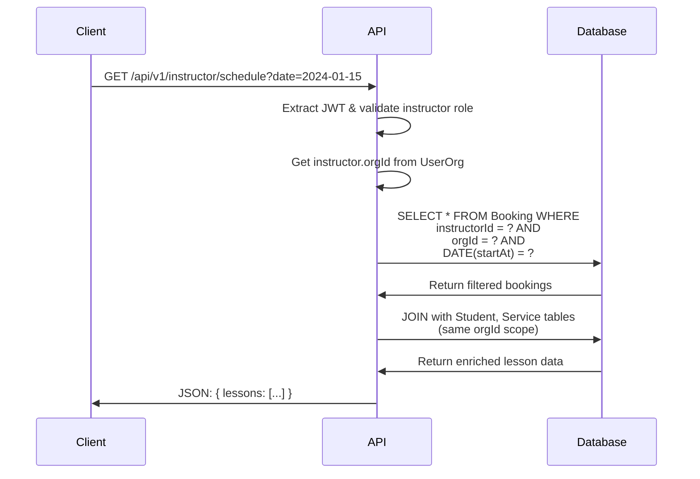
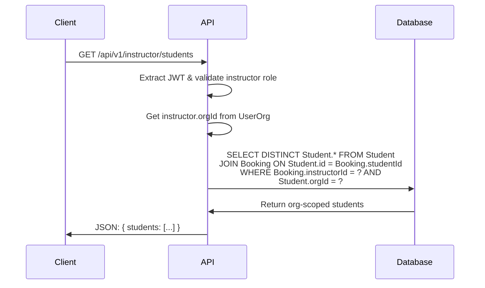
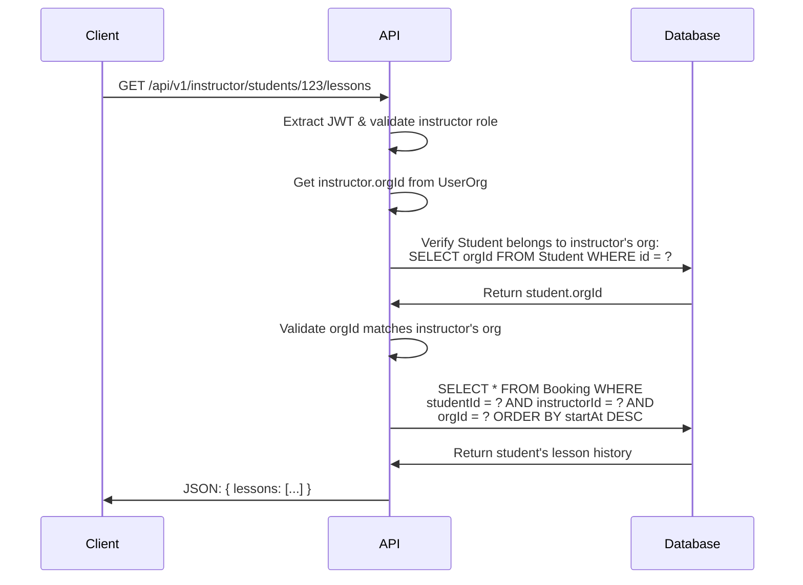
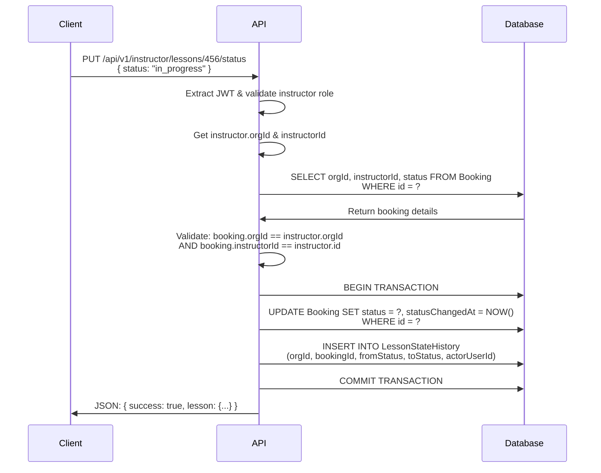
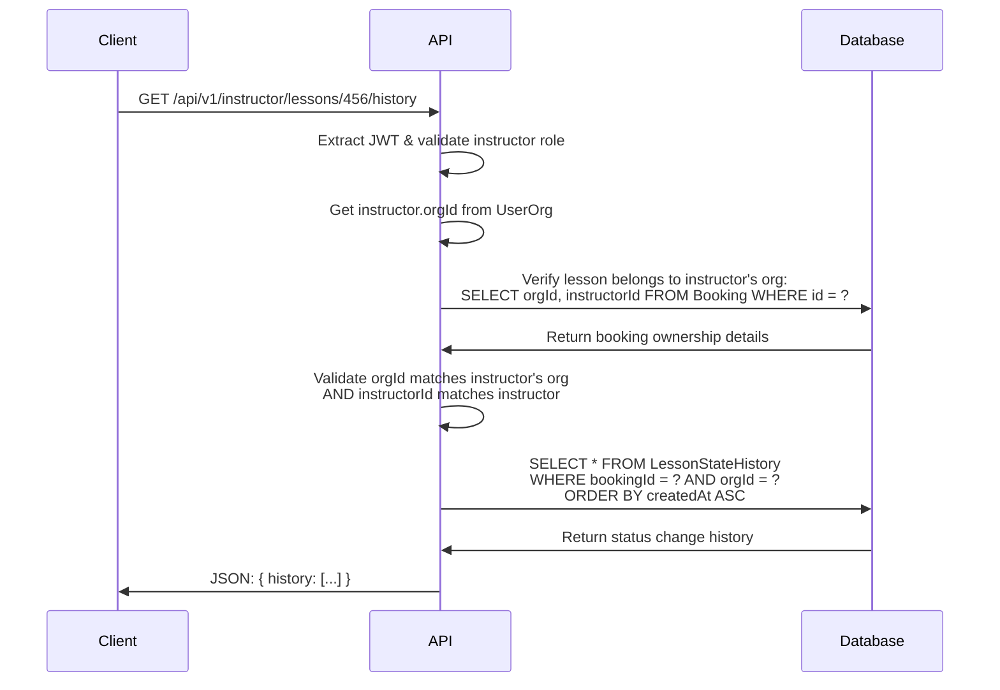

# Organization-Based Instructor Portal

## Overview

Create a lesson management portal for instructors employed by driving schools, enabling them to view their daily schedule, manage assigned lessons, and track student lesson history. This portal will be organization-scoped, ensuring instructors only access students and lessons from their assigned driving school.

**Problem Statement**: Instructors currently have no dedicated interface to manage their lessons, view schedules, or update lesson status. They need a simple, focused portal to handle day-to-day lesson operations while maintaining strict organizational boundaries for data security.

## Goals

- **Primary**: Enable instructors to efficiently manage their daily lesson schedule and update lesson status
- **Secondary**: Provide visibility into student lesson history for continuity of instruction
- **Business Value**: Reduce administrative overhead for driving schools and improve instructor productivity
- **User Benefits**: Streamlined lesson management workflow and better preparation for upcoming lessons

## User Stories

### Primary User Flows

- **As an instructor**, I want to view my today's schedule so that I can prepare for upcoming lessons
- **As an instructor**, I want to mark lessons as started when I begin teaching so that the system tracks lesson progress
- **As an instructor**, I want to mark lessons as completed when finished so that the booking is properly closed
- **As an instructor**, I want to cancel lessons when students don't show up so that the system reflects the accurate status
- **As an instructor**, I want to view my student's lesson history so that I can provide continuity in instruction

### Secondary User Flows

- **As an instructor**, I want to update my availability schedule so that I can manage my working hours (future scope)
- **As an instructor**, I want to see lesson details (pickup/dropoff locations, student notes) so that I can prepare effectively

### Developer User Flows

- **As a developer**, I want to easily switch between student and instructor roles during testing so that I can verify both user experiences without multiple accounts
- **As a developer**, I want quick login options for different user types so that I can rapidly test various scenarios

## Functional Requirements

### 1. Authentication & Role-Based Access

- **REQ-001**: Extend existing login page with developer-friendly role selection (Student/Instructor) for easy testing
- **REQ-002**: Implement quick login buttons or dropdown for different test users (e.g., "Login as Instructor John", "Login as Student Sarah")
- **REQ-003**: Implement instructor role checking using existing User and UserOrg models
- **REQ-004**: Ensure all instructor queries are scoped to instructor's orgId for multi-tenant security
- **REQ-005**: Redirect users to appropriate portal based on selected role (`/instructor` for instructors, `/lessons` for students)
- **REQ-006**: Provide role switching capability in development environment without full logout/login cycle

### 2. Instructor Dashboard

- **REQ-007**: Display today's lesson schedule as the primary view
- **REQ-008**: Show lesson cards with: time, student name, service type, pickup/dropoff locations, current status
- **REQ-009**: Filter lessons to only show those assigned to the logged-in instructor
- **REQ-010**: Display lessons chronologically (earliest first)
- **REQ-011**: Highlight current/upcoming lessons with visual indicators

### 3. Lesson Management

- **REQ-012**: Provide "Start Lesson" action for confirmed lessons at/near start time
- **REQ-013**: Provide "Complete Lesson" action for in-progress lessons
- **REQ-014**: Provide "Mark No-Show" action for lessons where students don't appear
- **REQ-015**: Update lesson status in real-time when actions are taken
- **REQ-016**: Prevent instructors from modifying lessons belonging to other instructors
- **REQ-017**: Show status history for transparency (when lesson was started, by whom, etc.)

### 4. Student Lesson History

- **REQ-018**: Display list of students assigned to the instructor within their organization
- **REQ-019**: Show complete lesson history for each student (past and upcoming)
- **REQ-020**: Include lesson status, dates, notes, and basic progress tracking
- **REQ-021**: Scope student access to instructor's organization only

### 5. Developer Testing Features

- **REQ-022**: Implement development-only quick user switching without authentication
- **REQ-023**: Provide test user seeds with different roles (instructors, students) across multiple organizations
- **REQ-024**: Include role indicator in UI header during development to show current test user context

### 6. Error Handling & Validation

- **REQ-025**: Validate that instructor belongs to the same organization as the lesson before allowing modifications
- **REQ-026**: Handle edge cases like lessons that are already started by another user
- **REQ-027**: Display friendly error messages for permission denied scenarios
- **REQ-028**: Gracefully handle network connectivity issues with appropriate feedback

## Non-Goals (Out of Scope)

- **Student progress tracking and detailed notes** (future phase)
- **Earnings and payout management** (separate feature)
- **Real-time notifications** (future enhancement)
- **Mobile app interface** (web-only for MVP)
- **Advanced availability management** (basic schedule viewing only)
- **GPS tracking integration** (future enhancement)
- **Bulk lesson operations** (individual lesson management only)
- **Instructor-to-instructor messaging** (future social features)

## Design Considerations

### UI/UX Requirements

- **Mobile-responsive design** for instructors using tablets/phones
- **Simple, task-focused interface** avoiding cognitive overload
- **Clear visual hierarchy** with today's schedule as primary focus
- **Consistent design system** using existing DriveFlow components from packages/ui
- **Quick action buttons** for common operations (Start, Complete, No-Show)
- **Status badges** with clear color coding for lesson states

### Component Usage

- Leverage existing `Button`, `Card`, `Badge`, `Table` components from packages/ui
- Use consistent spacing and typography from design system
- Implement loading states for async operations
- Follow existing color palette for status indicators

### Responsive Considerations

- **Desktop**: Full dashboard layout with sidebar navigation
- **Tablet**: Condensed layout with collapsible navigation
- **Mobile**: Stack layout with touch-friendly action buttons

## Technical Requirements

### Database Schema Changes

No new tables required. Utilize existing Prisma models:

- `User` - for instructor authentication
- `UserOrg` - for organization membership validation
- `Instructor` - for instructor-specific data
- `Booking` - for lesson data and status management
- `Student` - for student information (org-scoped)
- `Service` - for lesson type information
- `LessonStateHistory` - for audit trail of lesson status changes

### API Endpoints Needed

#### 1. GET /api/v1/instructor/schedule?date=YYYY-MM-DD

Get instructor's daily lesson schedule with organization scoping.

#### 2. GET /api/v1/instructor/students

Get list of students assigned to instructor within their organization.

#### 3. GET /api/v1/instructor/students/:id/lessons

Get complete lesson history for a specific student (org-scoped).

#### 4. PUT /api/v1/instructor/lessons/:id/status

Update lesson status with audit trail and organization validation.

#### 5. GET /api/v1/instructor/lessons/:id/history

Get audit trail for lesson status changes.

### Integration Points

- **Authentication**: Extend existing JWT-based auth system
- **Role Management**: Use existing UserOrg role checking
- **Lesson State Management**: Integrate with existing LessonStateHistory tracking
- **Mock Stripe Integration**: Connect with existing payment flow for completed lessons

### Real-time Features

- **Client-side state management** for immediate UI updates after lesson status changes
- **Optimistic updates** with rollback capability for failed operations
- **Auto-refresh** capability for schedule updates (manual trigger only)

## Multi-Tenancy & Security

### Organization Scoping (orgId)

- **Critical**: All database queries MUST include orgId filtering
- **Instructor Verification**: Verify instructor belongs to organization before any data access
- **Student Access**: Instructors can only view students from their assigned driving school
- **Cross-tenant Protection**: Explicit checks to prevent data leakage between organizations

### Role-Based Access Control

- **Instructor Role**: Users with UserOrg.role = 'INSTRUCTOR' can access instructor portal
- **Organization Membership**: Must have active UserOrg record for the organization
- **Lesson Assignment**: Can only modify lessons where Booking.instructorId matches logged-in instructor
- **Read-Only Student Data**: Instructors can view but not modify student information

### Data Privacy Considerations

- **Audit Logging**: Track all lesson status changes with actor identification
- **Minimal Data Exposure**: Only expose necessary student information to instructors
- **Session Management**: Proper session timeout and role-based redirects

## Success Metrics

### Key Performance Indicators

- **Adoption Rate**: % of instructors logging in and using the portal weekly
- **Lesson Status Updates**: % of lessons properly marked as started/completed by instructors
- **Time to Complete**: Average time for instructors to update lesson status
- **Error Rate**: Frequency of permission denied or invalid operation attempts

### Analytics/Tracking Requirements

- **Feature Usage**: Track which portal features are used most frequently
- **Session Duration**: Monitor how long instructors spend in the portal
- **Lesson Management Efficiency**: Time between lesson completion and status update
- **Organization-level Metrics**: Usage patterns across different driving schools

## Implementation Phases

### Phase 1: Core Authentication & Navigation (Week 1)

- **Dependencies**: Existing authentication system, UserOrg model
- **Deliverables**:
  - Enhanced login page with developer-friendly role selection
  - Quick login options for test users (development environment)
  - Instructor portal routing and layout
  - Organization-scoped authentication middleware
  - Role switching capability for development testing

### Phase 2: Schedule Dashboard (Week 2)

- **Dependencies**: Phase 1 completion, existing Booking API
- **Deliverables**:
  - Today's schedule view
  - Lesson cards with essential information
  - Organization-filtered lesson queries

### Phase 3: Lesson Status Management (Week 3)

- **Dependencies**: Phase 2 completion, LessonStateHistory system
- **Deliverables**:
  - Start/Complete/No-Show lesson actions
  - Status update API endpoints
  - Audit trail integration

### Phase 4: Student History View (Week 4)

- **Dependencies**: Phase 3 completion
- **Deliverables**:
  - Student list for instructor's organization
  - Individual student lesson history
  - Comprehensive lesson status tracking

## Open Questions

### Technical Decisions

1. **State Management**: Should we use React Context or implement a lightweight state management solution for instructor portal state?
2. **Caching Strategy**: How should we handle caching of instructor schedules and student data for performance?
3. **Offline Capability**: Should the portal work offline for viewing schedules, or is online-only acceptable for MVP?

### Business Logic Clarifications

4. **Lesson Timing**: What buffer time should instructors have to start lessons (e.g., can start 15 minutes early/late)?
5. **Status Conflicts**: How should we handle cases where admin users change lesson status while instructor is also updating?
6. **Organization Changes**: How should we handle instructors who transfer between driving schools?

### Future Considerations

7. **Mobile App**: Timeline for native mobile app development for instructors
8. **Integration Roadmap**: Priority order for GPS tracking, notifications, and payment integrations
9. **Scalability**: Expected number of concurrent instructor users per organization

---

**Next Steps**:

1. Review and approve this PRD
2. Create detailed wireframes for instructor portal UI
3. Set up development environment with organization-scoped authentication
4. Begin Phase 1 implementation with enhanced login system
