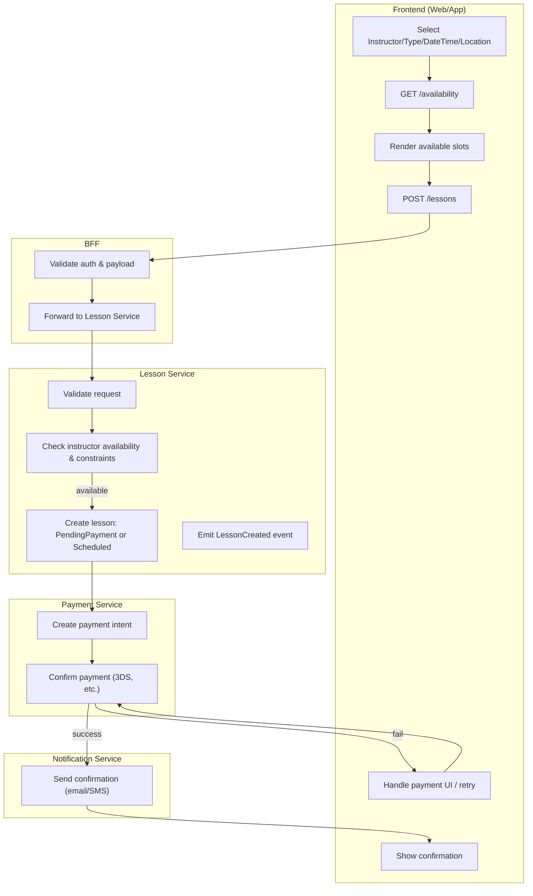
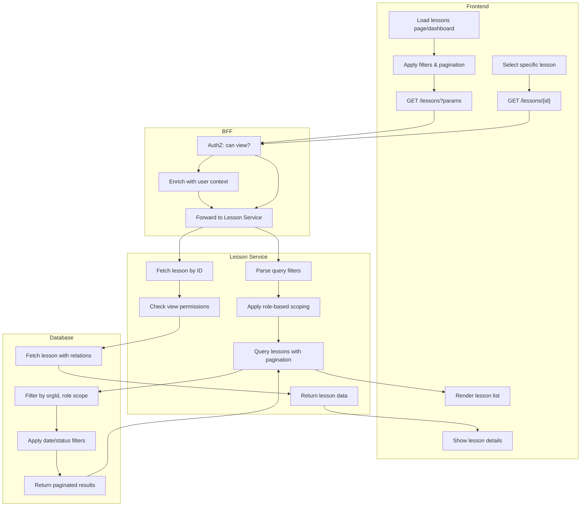
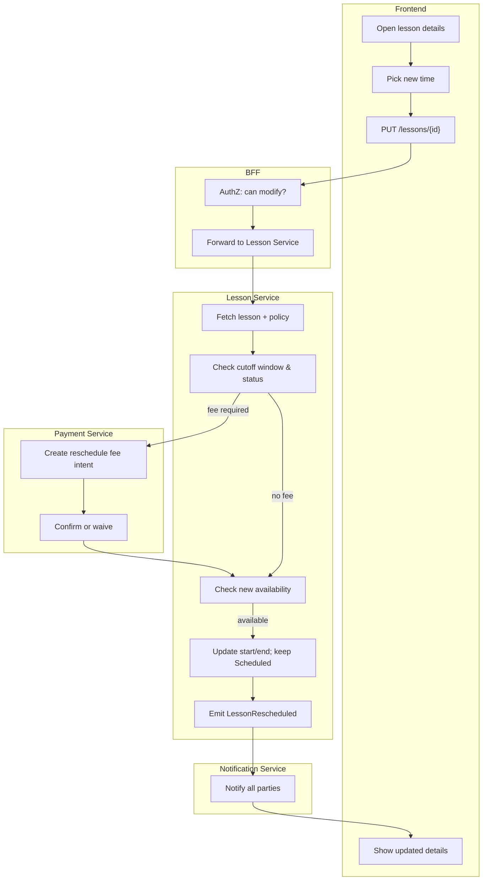
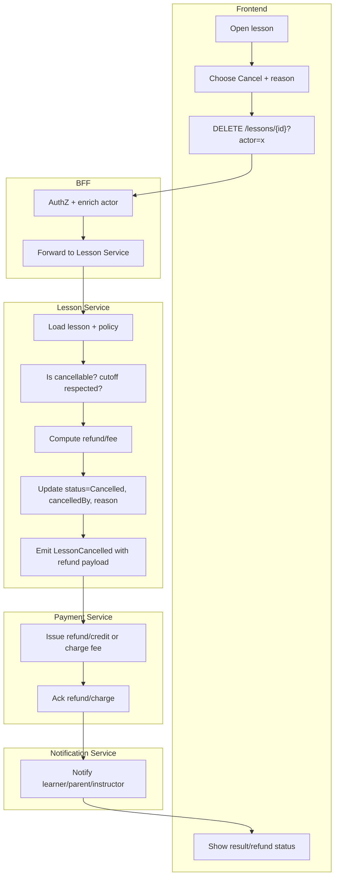

# DriveFlow — Lesson CRUD Flows (Create / Read / Update / Cancel)

*Authored as Senior Technical Business Analyst — developer‑ready documentation.*

---

## 1. Scope & Context

Lesson management for driving schools covering:
- **Create / Book**
- **Read / Retrieve**
- **Update / Reschedule**
- **Cancel** (learner, instructor, admin)
- Integrated **availability**, **payments**, **notifications**, and **policy** enforcement.

Actors: **Learner**, **Parent**, **Instructor**, **Admin**.

---

## 2. Create (Book a Lesson)

### 2.1 Swimlane (Mermaid — Flowchart with subgraphs)



### 2.2 Step‑by‑step (happy path)

1. FE validates inputs
2. `GET /availability?instructorId&start&end&type`
3. User selects a slot
4. `POST /lessons` with `{ learnerId, instructorId, start, end, type, location, paymentMethod }`
5. LessonSvc: hard‑hold slot, write `status=PendingPayment` (or `Scheduled` if wallet/credit covers)
6. PaymentSvc: create + confirm intent → success
7. NotificationSvc sends confirmations to learner/parent/instructor.

### 2.3 Validations & Notes

- Slot free & in working hours; travel buffer; daylight/night rules; license type.
- Idempotency header for `POST /lessons` to avoid duplicates.
- Payment edge cases: 3‑D Secure, partial wallet + card top‑up.
- Audit every decision point.

### 2.4 Availability Service Integration Requirements

#### **Critical Gap: Sophisticated Availability Checking**
The lesson booking system requires comprehensive availability validation beyond simple time slot checking:

**Travel Buffer Calculations:**
- **Distance-Based Buffers**: Calculate travel time between lesson locations using Maps API
- **Dynamic Buffers**: Adjust buffer time based on traffic conditions, time of day, and route complexity
- **Multi-Location Support**: Handle instructors teaching at multiple pickup/drop-off points
- **Buffer Minimums**: Enforce minimum 15-minute buffer between lessons, configurable per instructor
- **Route Optimization**: Suggest optimal lesson sequencing to minimize travel time

**Working Hours & Scheduling Constraints:**
- **Instructor Availability Windows**: Personal working hours (e.g., 8:00-18:00 weekdays)
- **Organization Hours**: Business operation hours that override instructor preferences
- **Break Time Management**: Mandatory breaks (lunch, rest periods) with buffer enforcement
- **Weekly Schedule Patterns**: Recurring availability patterns with exception handling
- **Holiday & Leave Management**: Integration with instructor leave/holiday calendar

**License Type Compatibility Validation:**
- **Student License Requirements**: Match lesson type with student's current license level
- **Instructor Certifications**: Verify instructor qualifications for specific lesson types (e.g., manual vs automatic, heavy vehicle)
- **Progression Rules**: Enforce prerequisite lessons before advanced training
- **Restriction Validation**: Check student restrictions (medical, age-based, legal)

**Time-of-Day & Environmental Rules:**
- **Daylight Restrictions**: Learner drivers restricted to daylight hours (sunrise to sunset)
- **Night Driving Certification**: Advanced lessons requiring special instructor certification
- **Weather Conditions**: Integration with weather API for lesson safety assessment
- **Peak Hour Limitations**: Restricted lesson types during rush hour periods
- **School Zone Restrictions**: Time-based restrictions around educational facilities

**Implementation Requirements:**
```typescript
// Availability Service Interface
interface AvailabilityService {
  checkSlotAvailability(request: AvailabilityRequest): Promise<AvailabilityResult>;
  calculateTravelBuffer(from: Location, to: Location, timeOfDay: Date): Promise<number>;
  validateLicenseCompatibility(studentId: string, lessonType: string): Promise<ValidationResult>;
  checkTimeRestrictions(dateTime: Date, studentId: string, instructorId: string): Promise<RestrictionResult>;
  getAvailableSlots(filters: AvailabilityFilters): Promise<AvailableSlot[]>;
}

// Availability Request
interface AvailabilityRequest {
  instructorId: string;
  studentId: string;
  lessonType: string;
  startTime: Date;
  endTime: Date;
  pickupLocation: Location;
  dropoffLocation?: Location;
}

// Availability Filters
interface AvailabilityFilters {
  instructorIds?: string[];
  lessonTypes?: string[];
  dateRange: { start: Date; end: Date };
  minDuration: number;
  location?: Location;
  maxTravelDistance?: number;
}
```

**Database Requirements:**
- **Instructor Working Hours**: Flexible schedule patterns with recurring rules and exceptions
- **Travel Time Cache**: Pre-calculated travel times between common locations with TTL
- **License Compatibility Matrix**: Student license types vs available lesson types
- **Time Restriction Rules**: Configurable rules for daylight, weather, and peak hour restrictions
- **Location Geocoding**: Cached latitude/longitude for all pickup/dropoff locations

**External Integrations:**
- **Maps API**: Real-time travel time calculations with traffic data
- **Weather API**: Current and forecasted weather conditions for safety assessment
- **Geocoding Service**: Address to coordinate conversion for location-based calculations

---

## 3. Read (Retrieve)

### 3.1 Swimlane (Mermaid — Flowchart with subgraphs)



### 3.2 Step‑by‑step (happy path)

#### List Lessons Flow:
1. User navigates to lessons page (dashboard/calendar view)
2. FE applies default filters (current week, user's scope)
3. `GET /lessons?actorScope=self&from=2025-08-12&to=2025-08-18&page=1`
4. LessonSvc applies role-based filtering:
   - **Learner/Parent**: only their lessons
   - **Instructor**: lessons they're teaching
   - **Admin**: all org lessons (with optional filters)
5. DB query with pagination, returns lesson summaries
6. FE renders list with key info: time, status, participants

#### Lesson Details Flow:
1. User clicks on specific lesson from list
2. `GET /lessons/{lessonId}` 
3. Permission check: can user view this lesson?
4. Fetch full lesson details with relations (instructor, learner, payment)
5. Return complete lesson object
6. FE shows detailed view with actions (reschedule/cancel if allowed)

### 3.3 Role-Based Data Scoping

- **Learner**: Can view own lessons only (`learnerId = userId`)
- **Parent**: Can view lessons for their children (`learnerId IN childrenIds`)
- **Instructor**: Can view lessons they're teaching (`instructorId = userId`)  
- **Admin**: Can view all lessons in their org (`orgId = userOrgId`)

### 3.4 Performance & Caching Notes

- **Pagination**: Default 25 items, max 100 per page
- **Indexes**: `(orgId, instructorId, start)`, `(orgId, learnerId, start)`
- **Caching**: Cache lesson lists for 30s, individual lessons for 5min
- **Eager Loading**: Include instructor/learner names in list view
- **Lazy Loading**: Full payment/audit details only on detail view

---

## 4. Update (Reschedule)

### 4.1 Swimlane (Mermaid — Flowchart with subgraphs)



### 4.2 Step‑by‑step (happy path)

1. User opens lesson
2. Picks new slot (availability rechecked)
3. `PUT /lessons/{id}` with `{ start, end, reason=Reschedule }`
4. Policy check: within reschedule window? Apply fee?
5. If fee → Payment intent; on success, update lesson; if waived, continue
6. Persist changes; emit `LessonRescheduled`; send notifications.

### 4.3 Guardrails

- Not allowed if `status ∈ {Completed, Cancelled, NoShow}` or within hard cutoff (e.g., <2h).
- Audit: who changed, when, old/new time diff.
- Prevent instructor overlap via exclusion constraints.

---

## 5. Cancel (Learner / Instructor / Admin)

### 5.1 Swimlane (Mermaid — Flowchart with subgraphs)



### 5.2 Policy Matrix (examples)

- **Learner‑initiated**
    - ≥24h before: 100% refund to original method or wallet credit
    - 2–24h: 50% fee (configurable)
    - <2h: no refund (except admin override)
- **Instructor‑initiated**: full refund + auto‑priority for rebooking
- **Admin override**: any outcome permitted; reason mandatory

### 5.3 Edge Cases

- If payment never captured (`PendingPayment`): cancel without refund; release hold.
- If coupon/credit used: restore pro‑rata to wallet; keep audit trail.
- Payment failures: do not attempt refund; surface state clearly to support.

---

## 6. API Contracts

### 6.1 POST /lessons

**Headers**: `Authorization: Bearer <token>`, `Idempotency-Key: <uuid>`

**Body**

```json
{  "learnerId": "11111111-1111-1111-1111-111111111111",  "instructorId": "22222222-2222-2222-2222-222222222222",  "type": "Standard",  "start": "2025-08-12T10:00:00+05:30",  "end": "2025-08-12T11:00:00+05:30",  "location": {"lat": -33.86, "lng": 151.21, "label": "Sydney CBD"},  "paymentMethod": "wallet",  "notes": "Focus: reverse parking"}
```

**201 Created**

```json
{ "lessonId": "33333333-3333-3333-3333-333333333333", "status": "Scheduled", "paymentStatus": "Paid" }
```

**Errors**: `409 SLOT_TAKEN`, `422 POLICY_VIOLATION`, `402 PAYMENT_REQUIRED`, `403 FORBIDDEN`

### 6.2 GET /lessons

`/lessons?actorScope=self|instructor|admin&instructorId&learnerId&from&to&status&page&pageSize`

**200 OK**

```json
{ "items": [{ "id":"...", "start":"...", "status":"Scheduled" }], "page":1, "pageSize":25, "total":120 }
```

### 6.3 GET /lessons/{lessonId}

**200 OK**

```json
{  "id": "33333333-3333-3333-3333-333333333333",  "learnerId": "11111111-1111-1111-1111-111111111111",  "instructorId": "22222222-2222-2222-2222-222222222222",  "type": "Standard",  "start": "2025-08-12T10:00:00+05:30",  "end": "2025-08-12T11:00:00+05:30",  "location": {"lat": -33.86, "lng": 151.21, "label": "Sydney CBD"},  "status": "Scheduled",  "paymentStatus": "Paid",  "createdAt": "2025-08-10T12:00:00Z",  "updatedAt": "2025-08-10T12:05:00Z"}
```

### 6.4 PUT /lessons/{lessonId}

**Body**

```json
{  "start": "2025-08-13T14:00:00+05:30",  "end": "2025-08-13T15:00:00+05:30",  "reason": "Reschedule",  "applyFee": true}
```

**200 OK**

```json
{ "id": "33333333-3333-3333-3333-333333333333", "status":"Scheduled", "oldStart":"2025-08-12T10:00:00+05:30", "newStart":"2025-08-13T14:00:00+05:30", "feeApplied": true }
```

**Errors**: `409 SLOT_TAKEN`, `422 CUTOFF_EXCEEDED`, `409 NOT_RESCHEDULABLE`

### 6.5 DELETE /lessons/{lessonId}

**Body or Query**

```json
{ "actor": "Learner", "reason": "Feeling unwell" }
```

**200 OK**

```json
{ "id":"33333333-3333-3333-3333-333333333333", "status":"Cancelled", "refund": { "amount": 50.00, "currency": "AUD", "method": "wallet" } }
```

---

## 7. State Model & Transition Requirements

### 7.1 Lesson Lifecycle States

```
Draft -> PendingPayment -> Scheduled -> InProgress -> Completed
                         \-> Cancelled (policy-driven)
Scheduled -> NoShow (auto after grace)
```

**Disallowed transitions:** `Completed/Cancelled/NoShow` → anything (except Admin data fix endpoint with strict audit).

### 7.2 State Management Implementation Requirements

#### **Critical Gap: State Transition Engine**
The lesson CRUD system requires a sophisticated state management engine beyond simple status updates:

**State Transition Validation Logic:**
- **Guard Conditions**: Each transition must validate prerequisites (payment status, time constraints, user permissions)
- **Business Rules**: Enforce cancellation policies, reschedule windows, and grace periods
- **Atomic Operations**: State changes must be transactional with audit logging
- **Rollback Capability**: Failed transitions must revert cleanly with error reporting

**Auto-Progression Rules:**
- **NoShow Detection**: Automatically transition `Scheduled → NoShow` after configurable grace period (default 15 minutes)
- **Payment Timeout**: Transition `PendingPayment → Cancelled` after payment window expires (default 30 minutes)
- **Lesson Completion**: Instructor-initiated transition `InProgress → Completed` with optional feedback capture
- **Scheduled Tasks**: Background jobs for state transitions with retry logic and monitoring

**State-Specific Behaviors:**
- **Draft**: Temporary state for lesson creation workflow, auto-cleanup after 1 hour
- **PendingPayment**: Hold instructor availability, enable payment retry, timeout handling
- **Scheduled**: Enable reschedule/cancel actions, send reminder notifications, availability release on cancel
- **InProgress**: GPS tracking (mobile), disable modifications, enable completion actions
- **Completed**: Generate completion certificates, trigger payout processing, enable feedback collection
- **Cancelled**: Process refunds, release availability, audit trail capture
- **NoShow**: Instructor compensation handling, automatic rescheduling offers

**Implementation Requirements:**
```typescript
// State Machine Interface
interface LessonStateMachine {
  canTransition(from: LessonStatus, to: LessonStatus, context: TransitionContext): boolean;
  executeTransition(lessonId: string, newStatus: LessonStatus, context: TransitionContext): Promise<LessonStateResult>;
  getAvailableTransitions(currentStatus: LessonStatus, userRole: OrgRole): LessonStatus[];
  scheduleAutoTransitions(lessonId: string): Promise<void>;
}

// Transition Context
interface TransitionContext {
  actor: AuthenticatedUser;
  reason?: string;
  metadata?: Record<string, any>;
  forceOverride?: boolean; // Admin only
}
```

**Database Requirements:**
- **State History Table**: Track all state changes with timestamps, actors, and reasons
- **Scheduled Transitions**: Queue for background state changes with retry logic
- **State Locks**: Prevent concurrent state modifications with optimistic locking

---

## 8. Role-Based Access Control (RBAC) Requirements

### 8.1 RBAC Architecture Integration

The Lesson CRUD API must integrate with DriveFlow's existing RBAC system using:

- **JWT Authentication Guard** (`JwtAuthGuard`)
- **Role Authorization Guard** (`RoleGuard`) 
- **Permission-based decorators** (`@Permissions`, `@ScopedLessonAccess`)
- **Organization scoping** for multi-tenancy
- **Audit logging** for all authorization decisions

### 8.2 Role-Based Permission Matrix

#### **Owner Role**
- **Permissions**: Full access to all lesson operations
- **Scope**: All lessons within their organization
- **CRUD Access**: 
  - ✅ Create lessons for any student/instructor
  - ✅ Read all org lessons with full details
  - ✅ Update/reschedule any lesson
  - ✅ Cancel/delete any lesson with full refund control

#### **Admin Role** 
- **Permissions**: Nearly full access (cannot delete org)
- **Scope**: All lessons within their organization  
- **CRUD Access**:
  - ✅ Create lessons for any student/instructor
  - ✅ Read all org lessons with full details
  - ✅ Update/reschedule any lesson
  - ✅ Cancel lessons with refund processing

#### **Instructor Role**
- **Permissions**: `lessons:read`, `lessons:write`, `lessons:create`, `students:read` (scoped)
- **Scope**: Only lessons they teach + assigned students
- **CRUD Access**:
  - ✅ Create lessons for assigned students only
  - ✅ Read lessons where `instructorId = user.id` OR `studentId IN assignedStudentIds`
  - ✅ Update/reschedule their own lessons
  - ❌ Cannot delete lessons (admin function)

#### **Student Role**
- **Permissions**: `lessons:read`, `bookings:create` (scoped to self)
- **Scope**: Only own lessons + children's lessons (for parents)
- **CRUD Access**:
  - ✅ Create bookings for self/children
  - ✅ Read lessons where `studentId IN [self, children]`
  - ❌ Cannot update lessons directly (must request via instructor/admin)
  - ❌ Cannot delete lessons (can request cancellation)

### 8.3 Endpoint-Specific RBAC Implementation

#### **POST /lessons (Create)**
```typescript
@Permissions('lessons:create', 'bookings:create')
// All roles can create, but scoped:
// - Students: only for self/children
// - Instructors: only for assigned students  
// - Admin/Owner: any student in org
```

#### **GET /lessons (List)**
```typescript
@ScopedLessonAccess() // Uses 'lessons:read' + automatic scoping
// Returns filtered results based on role:
// - Students: WHERE studentId IN [self, children]
// - Instructors: WHERE instructorId = user.id OR studentId IN assignedStudents
// - Admin/Owner: WHERE orgId = user.orgId (all org lessons)
```

#### **GET /lessons/:id (Details)**
```typescript
@ScopedLessonAccess()
// Returns lesson if user has scoped access:
// - Students: only if they are the student or parent
// - Instructors: only if they teach the lesson or student is assigned
// - Admin/Owner: any lesson in org
```

#### **PUT /lessons/:id (Update/Reschedule)**
```typescript
@AuthorizedEndpoint(['owner', 'admin', 'instructor'], ['lessons:write'], true)
// Can modify lesson if:
// - Instructors: they teach the lesson
// - Admin/Owner: any org lesson
// - Students: cannot directly update (request only)
```

#### **DELETE /lessons/:id (Cancel)**
```typescript
@Permissions('lessons:delete')
// Soft cancel vs hard delete:
// - Students: can request cancellation (soft)
// - Instructors: can cancel their lessons
// - Admin/Owner: can hard delete any org lesson
```

### 8.4 Data Scoping Implementation

#### **Automatic Scoping via RoleGuard**
The `RoleGuard` automatically adds `scopedResourceIds` to the request:

```typescript
// For Instructors:
request.scopedResourceIds = ['student-1-id', 'student-2-id'] // assignedStudentIds

// For Students/Parents:
request.scopedResourceIds = ['student-id', 'child-1-id'] // self + children

// For Admin/Owner:
// No additional scoping (org-level access)
```

#### **Service Layer Filtering**
```typescript
// LessonService applies role-based filters:
switch (user.role) {
  case 'instructor':
    return { instructorId: user.id };
  case 'student':
    return { studentId: { in: request.scopedResourceIds } };
  case 'admin':
  case 'owner':
    return {}; // No additional filtering beyond orgId
}
```

### 8.5 Multi-Tenancy & Organization Scoping

#### **Mandatory Organization Context**
- All lesson queries MUST include `orgId = user.orgId`
- Cross-organization access is strictly prohibited
- Data isolation enforced at database and service levels

#### **Organization Boundary Enforcement**
```typescript
// Every lesson operation includes:
const baseFilter = {
  orgId: user.orgId, // Mandatory org scoping
  ...roleBasedFilters  // Additional role-based restrictions
};
```

### 8.6 Audit & Security Requirements

#### **Authorization Audit Trail**
All RBAC decisions must be logged:
```typescript
{
  userId: 'instructor-123',
  event: 'authorization_granted|denied',
  endpoint: 'GET /v1/lessons',
  requiredPermissions: ['lessons:read'],
  userRole: 'instructor',
  orgId: 'org-456',
  scopedResourceIds: ['student-1', 'student-2'],
  timestamp: '2025-08-14T10:00:00Z'
}
```

#### **Permission Edge Cases**
- **Instructor accessing unassigned student lesson**: 403 Forbidden
- **Student accessing another student's lesson**: 403 Forbidden  
- **Cross-org access attempts**: 404 Not Found (don't reveal existence)
- **Permission escalation attempts**: Logged + 403 Forbidden

#### **Security Validations**
- Validate `instructorId` in create requests matches assigned students
- Verify lesson ownership before updates/cancellations
- Check policy constraints before allowing modifications
- Audit all permission bypass attempts

### 8.7 RBAC Testing Requirements

#### **Role-Based Test Scenarios**
- ✅ Each role can only access scoped resources
- ✅ Cross-role access attempts are properly blocked
- ✅ Organization boundaries are enforced
- ✅ Permission escalation is prevented
- ✅ Audit logs capture all authorization decisions

#### **Scoped Access Validation**
- ✅ Instructors see only assigned student lessons
- ✅ Students see only own/children lessons
- ✅ Admin/Owner see all org lessons
- ✅ Scoping works for both list and detail endpoints

#### **Edge Case Testing**
- ✅ Instructor assignment changes reflect immediately in access
- ✅ Student role changes (e.g., becoming parent) update scoping
- ✅ Cross-org lesson access attempts fail gracefully
- ✅ Invalid permission combinations are rejected

---

## 9. Data & Persistence Notes

- **Unique exclusion** on `(instructorId, start, end)` to prevent overlaps.
- **Outbox** events: `LessonCreated | LessonRescheduled | LessonCancelled`.
- **Audit**: `lesson_audit(lessonId, actor, action, before, after, at)` JSON diff.
- **Time zones**: store UTC, render per user; beware DST for AU.
- **Idempotency** keys on create & payment operations.

---

## 10. QA Scenarios (selected)

### **Core Functionality**
- Cannot book overlapping instructor slots (but different instructors can overlap).
- Reschedule within cutoff prompts fee; blocks if unpaid.
- Cancelling unpaid `PendingPayment` releases hold without refund.
- Wallet + card split payments refund correctly to sources.
- Policy overrides by Admin require reason and audit entry.
- Notification fanout verified to all parties.

### **RBAC & Security Scenarios**
- **Instructor Scoping**: Instructor can only see lessons for assigned students; attempting to access unassigned lesson returns 403.
- **Student Scoping**: Student can only see own lessons (+ children for parents); attempting to access other student's lesson returns 403.
- **Cross-Org Isolation**: User from Org A attempting to access lesson from Org B returns 404 (not 403, to avoid revealing existence).
- **Permission Escalation**: Student attempting to update/delete lesson directly (vs request) returns 403 with audit log entry.
- **Role Assignment Changes**: When instructor is unassigned from student, previously accessible lessons become 403 immediately.
- **Admin Override**: Admin can cancel any org lesson with full refund, including overriding instructor-only policies.
- **Audit Trail**: All RBAC decisions (granted/denied) are logged with user context, endpoint, and scoped resources.

---

## 11. Appendix — Sample Errors

### **Business Logic Errors**
```json
{ "error": "SLOT_TAKEN", "message": "The selected time is no longer available." }
{ "error": "CUTOFF_EXCEEDED", "message": "Rescheduling not permitted within 2 hours of start." }
{ "error": "NOT_RESCHEDULABLE", "message": "Completed lessons cannot be rescheduled." }
```

### **RBAC & Security Errors**
```json
{ "error": "INSUFFICIENT_PERMISSIONS", "message": "Missing required permissions: lessons:write" }
{ "error": "ACCESS_DENIED", "message": "Instructor not assigned to this student" }
{ "error": "RESOURCE_NOT_FOUND", "message": "Lesson not found" }
{ "error": "SCOPE_VIOLATION", "message": "Students can only access their own resources" }
{ "error": "ORG_BOUNDARY_VIOLATION", "message": "Cross-organization access not permitted" }
{ "error": "ROLE_RESTRICTION", "message": "This action requires admin privileges" }
```

### **Authentication Errors**
```json
{ "error": "UNAUTHORIZED", "message": "Access token is required" }
{ "error": "TOKEN_EXPIRED", "message": "Access token has expired" }
{ "error": "INVALID_TOKEN", "message": "Invalid access token" }
```

---

**End of document.**

---

## 12. Requirements ↔︎ Persona Traceability

This section links functional requirements to the personas they serve. Use it during backlog refinement, sprint planning, and UAT.

### 12.1 Capability ↔︎ Persona Matrix (High‑level)

| Capability | ID | Learner | Parent | Instructor | Admin | Priority | Notes |
| --- | --- | --- | --- | --- | --- | --- | --- |
| Create / Book lesson | C-01 | ✓ | ✓ | ✓ | ✓ | Must | Parent books for learner; admin can book on behalf; instructor can create blocks/lessons |
| Read / Retrieve lessons | C-02 | ✓ | ✓ | ✓ | ✓ | Must | Filters by date/status; scope-limited by role |
| Update / Reschedule | C-03 | ✓ | ✓ | ✓ | ✓ | Must | Policy cutoff + potential fee |
| Cancel lesson | C-04 | ✓ | ✓ | ✓ | ✓ | Must | Refund/fee matrix varies by actor |
| Notifications | C-05 | ✓ | ✓ | ✓ | ✓ | Must | Email/SMS on create/update/cancel |
| Payments & Refunds | C-06 | ✓ | ✓ |  | ✓ | Must | Card/wallet support; admin overrides |
| Audit & Events | C-07 |  |  |  | ✓ | Must | Full audit, outbox events |

### 12.2 Functional Requirements Mapped to Personas

### Create / Book

| Req ID | Requirement | Primary Persona(s) | Impacted Persona(s) | Acceptance Hints |
| --- | --- | --- | --- | --- |
| F-01 | Select instructor, time, type, location | Learner, Parent | Instructor, Admin | UI allows constrained choices; form validation |
| F-02 | Validate instructor availability & constraints | Learner, Parent | Instructor | Reject if overlap, travel buffer or outside hours |
| F-03 | Create lesson in `PendingPayment` or `Scheduled` | Learner, Parent | Instructor, Admin | Idempotent create; state set correctly |
| F-04 | Payment intent + confirmation (3DS etc.) | Learner, Parent | Admin | Handles wallet + card top-ups |
| F-05 | Send notifications after booking | Learner, Parent | Instructor, Admin | All parties receive message with iCal link |

### Read / Retrieve

| Req ID | Requirement | Primary Persona(s) | Impacted Persona(s) | Acceptance Hints |
| --- | --- | --- | --- | --- |
| F-06 | List lessons with filters & pagination | Learner, Parent, Instructor | Admin | Role-limited scope; performant queries |
| F-07 | View lesson details | Learner, Parent, Instructor | Admin | Includes payment & status metadata |

### Update / Reschedule

| Req ID | Requirement | Primary Persona(s) | Impacted Persona(s) | Acceptance Hints |
| --- | --- | --- | --- | --- |
| F-08 | Policy cutoff & reschedule fee evaluation | Learner, Parent, Instructor | Admin | Enforce configurable windows/fees |
| F-09 | Re-check availability at new time | Learner, Parent, Instructor | Admin | Prevent overlaps post-change |
| F-10 | Persist change, emit event, notify | Learner, Parent, Instructor | Admin | Clear diff in audit; all parties updated |

### Cancel

| Req ID | Requirement | Primary Persona(s) | Impacted Persona(s) | Acceptance Hints |
| --- | --- | --- | --- | --- |
| F-11 | Compute refund/fee by actor & cutoff | Learner, Parent, Instructor | Admin | Apply matrix; show user-facing breakdown |
| F-12 | Execute refund/charge via Payment Service | Learner, Parent | Admin | Pro‑rata wallet/card restoration |
| F-13 | Update `Cancelled`, capture who/why, notify | All | All | Reason required; audit trail; event outbox |

### Cross-cutting

| Req ID | Requirement | Primary Persona(s) | Impacted Persona(s) | Acceptance Hints |
| --- | --- | --- | --- | --- |
| F-14 | Auto mark `NoShow` after grace | Instructor | Learner, Parent, Admin | Scheduled job; policy-driven |
| F-15 | Admin override on policy/refund | Admin | Learner, Parent, Instructor | Mandatory reason; audit + approval rules |

### 12.3 Non‑Functional Requirements (NFRs) tagged by Persona Risk

| NFR ID | Requirement | Persona Risk if unmet | Target |
| --- | --- | --- | --- |
| NF-01 | Role-based AuthZ & data scoping | Privacy breach (all) | Learner/Parent see own; Instructor sees own; Admin all |
| NF-02 | Idempotency for create/payments | Double bookings/charges (Learner/Parent) | Idempotency-Key + dedupe on server |
| NF-03 | Timezone correctness (AU + India) | Wrong times (all) | Store UTC; render per user; DST-safe |
| NF-04 | Performance SLAs | Slow UX (all) | Read <300ms p95; write <500ms p95 |
| NF-05 | Full audit logging | Disputes unresolvable (Admin) | Who/when/what diff JSON |
| NF-06 | Reliable event outbox | Missed notifications (all) | Exactly-once delivery semantics |
| NF-07 | PII minimisation | Compliance overhead (all) | Only necessary fields; masked logs |

### 12.4 UAT Scenarios by Persona (Shortlist)

- **Learner/Parent**
    - Book with wallet-only payment → success notification includes calendar invite.
    - Reschedule inside cutoff → fee prompted; on payment success, change applied.
    - Cancel ≥24h → full refund to original method; audit shows actor "Parent".
- **Instructor**
    - Attempt overlap booking via admin-created block → system prevents.
    - Reschedule initiated by instructor → no fee; learner notified.
    - NoShow auto-applied after grace; payout rules unaffected until admin review.
- **Admin**
    - Override late cancellation to full refund → reason mandatory; audit entry created.
    - Search lessons for a learner across instructors with filters → performance ok.
    - Payment failure followed by cancel → no refund attempted; state clear in UI.

> Tip: Prefix backlog items with these IDs (e.g., F-09, NF-03) so PRs and test cases trace cleanly back to persona value.
