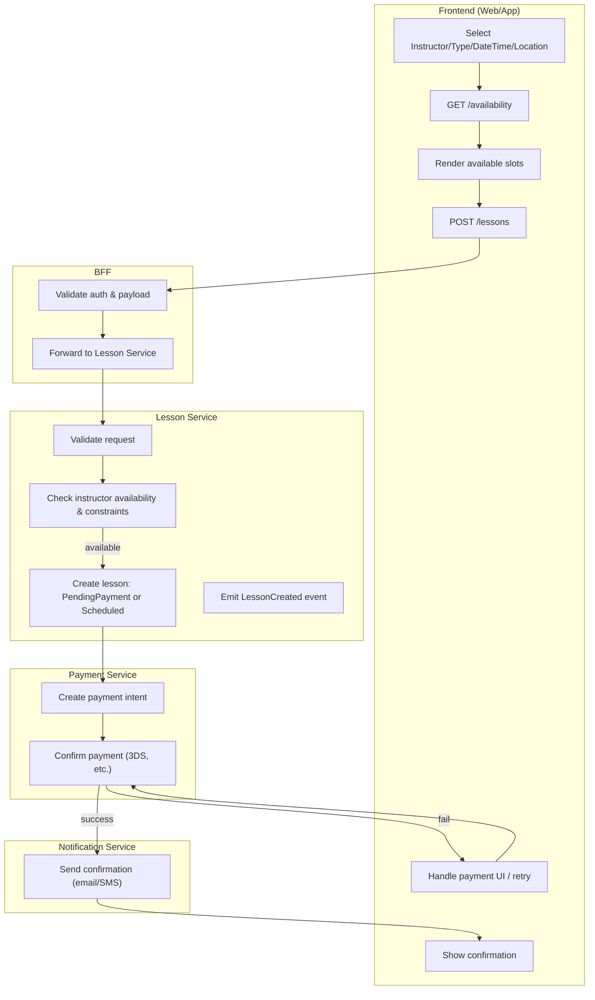
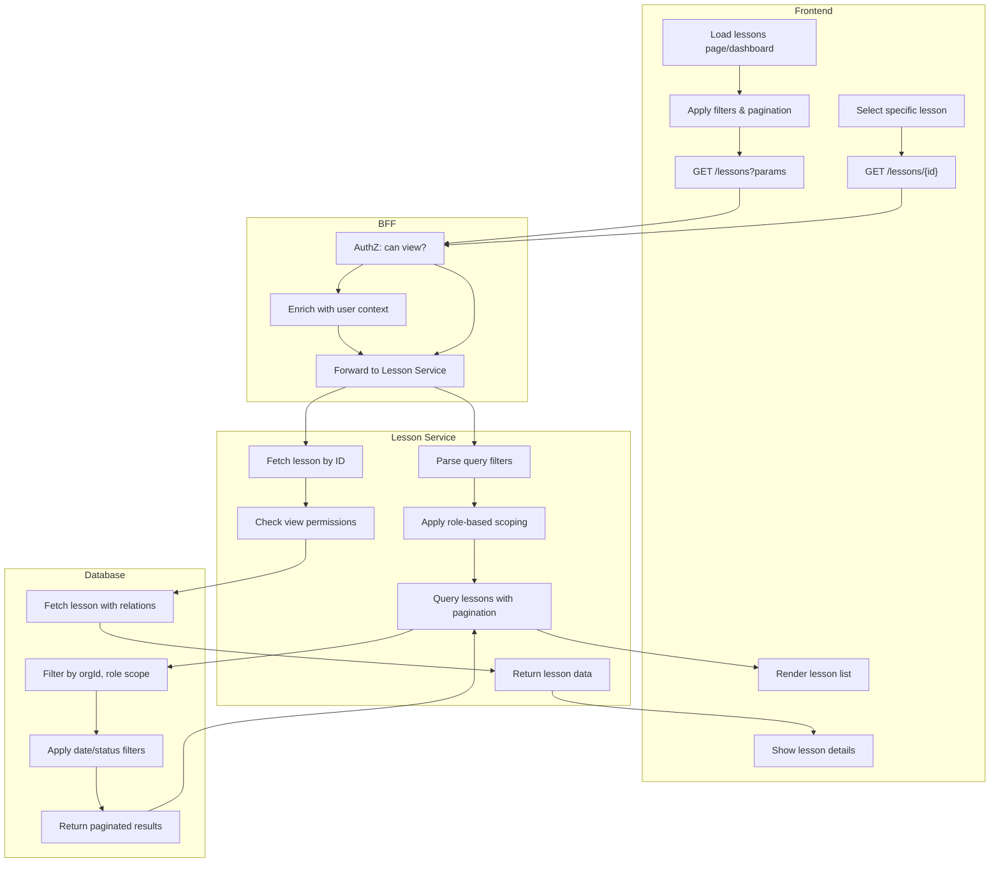
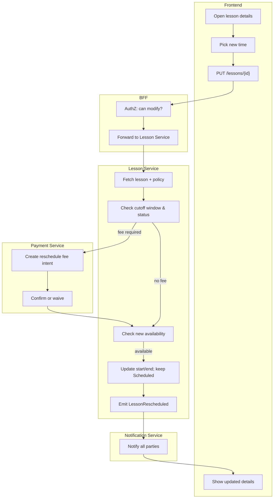
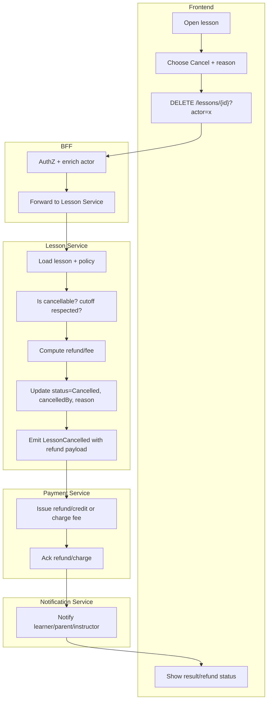

# DriveFlow — Lesson CRUD Flows (Create / Read / Update / Cancel)

*Authored as Senior Technical Business Analyst — developer‑ready documentation.*

---

## 1. Scope & Context

Lesson management for driving schools covering:
- **Create / Book**
- **Read / Retrieve**
- **Update / Reschedule**
- **Cancel** (learner, instructor, admin)
- Integrated **availability**, **payments**, **notifications**, and **policy** enforcement.

Actors: **Learner**, **Parent**, **Instructor**, **Admin**.

---

## 2. Create (Book a Lesson)

### 2.1 Swimlane (Mermaid — Flowchart with subgraphs)



### 2.2 Step‑by‑step (happy path)

1. FE validates inputs
2. `GET /availability?instructorId&start&end&type`
3. User selects a slot
4. `POST /lessons` with `{ learnerId, instructorId, start, end, type, location, paymentMethod }`
5. LessonSvc: hard‑hold slot, write `status=PendingPayment` (or `Scheduled` if wallet/credit covers)
6. PaymentSvc: create + confirm intent → success
7. NotificationSvc sends confirmations to learner/parent/instructor.

### 2.3 Validations & Notes

- Slot free & in working hours; travel buffer; daylight/night rules; license type.
- Idempotency header for `POST /lessons` to avoid duplicates.
- Payment edge cases: 3‑D Secure, partial wallet + card top‑up.
- Audit every decision point.

---

## 3. Read (Retrieve)

### 3.1 Swimlane (Mermaid — Flowchart with subgraphs)



### 3.2 Step‑by‑step (happy path)

#### List Lessons Flow:
1. User navigates to lessons page (dashboard/calendar view)
2. FE applies default filters (current week, user's scope)
3. `GET /lessons?actorScope=self&from=2025-08-12&to=2025-08-18&page=1`
4. LessonSvc applies role-based filtering:
   - **Learner/Parent**: only their lessons
   - **Instructor**: lessons they're teaching
   - **Admin**: all org lessons (with optional filters)
5. DB query with pagination, returns lesson summaries
6. FE renders list with key info: time, status, participants

#### Lesson Details Flow:
1. User clicks on specific lesson from list
2. `GET /lessons/{lessonId}` 
3. Permission check: can user view this lesson?
4. Fetch full lesson details with relations (instructor, learner, payment)
5. Return complete lesson object
6. FE shows detailed view with actions (reschedule/cancel if allowed)

### 3.3 Role-Based Data Scoping

- **Learner**: Can view own lessons only (`learnerId = userId`)
- **Parent**: Can view lessons for their children (`learnerId IN childrenIds`)
- **Instructor**: Can view lessons they're teaching (`instructorId = userId`)  
- **Admin**: Can view all lessons in their org (`orgId = userOrgId`)

### 3.4 Performance & Caching Notes

- **Pagination**: Default 25 items, max 100 per page
- **Indexes**: `(orgId, instructorId, start)`, `(orgId, learnerId, start)`
- **Caching**: Cache lesson lists for 30s, individual lessons for 5min
- **Eager Loading**: Include instructor/learner names in list view
- **Lazy Loading**: Full payment/audit details only on detail view

---

## 4. Update (Reschedule)

### 4.1 Swimlane (Mermaid — Flowchart with subgraphs)



### 4.2 Step‑by‑step (happy path)

1. User opens lesson
2. Picks new slot (availability rechecked)
3. `PUT /lessons/{id}` with `{ start, end, reason=Reschedule }`
4. Policy check: within reschedule window? Apply fee?
5. If fee → Payment intent; on success, update lesson; if waived, continue
6. Persist changes; emit `LessonRescheduled`; send notifications.

### 4.3 Guardrails

- Not allowed if `status ∈ {Completed, Cancelled, NoShow}` or within hard cutoff (e.g., <2h).
- Audit: who changed, when, old/new time diff.
- Prevent instructor overlap via exclusion constraints.

---

## 5. Cancel (Learner / Instructor / Admin)

### 5.1 Swimlane (Mermaid — Flowchart with subgraphs)



### 5.2 Policy Matrix (examples)

- **Learner‑initiated**
    - ≥24h before: 100% refund to original method or wallet credit
    - 2–24h: 50% fee (configurable)
    - <2h: no refund (except admin override)
- **Instructor‑initiated**: full refund + auto‑priority for rebooking
- **Admin override**: any outcome permitted; reason mandatory

### 5.3 Edge Cases

- If payment never captured (`PendingPayment`): cancel without refund; release hold.
- If coupon/credit used: restore pro‑rata to wallet; keep audit trail.
- Payment failures: do not attempt refund; surface state clearly to support.

---

## 6. API Contracts

### 6.1 POST /lessons

**Headers**: `Authorization: Bearer <token>`, `Idempotency-Key: <uuid>`

**Body**

```json
{  "learnerId": "11111111-1111-1111-1111-111111111111",  "instructorId": "22222222-2222-2222-2222-222222222222",  "type": "Standard",  "start": "2025-08-12T10:00:00+05:30",  "end": "2025-08-12T11:00:00+05:30",  "location": {"lat": -33.86, "lng": 151.21, "label": "Sydney CBD"},  "paymentMethod": "wallet",  "notes": "Focus: reverse parking"}
```

**201 Created**

```json
{ "lessonId": "33333333-3333-3333-3333-333333333333", "status": "Scheduled", "paymentStatus": "Paid" }
```

**Errors**: `409 SLOT_TAKEN`, `422 POLICY_VIOLATION`, `402 PAYMENT_REQUIRED`, `403 FORBIDDEN`

### 6.2 GET /lessons

`/lessons?actorScope=self|instructor|admin&instructorId&learnerId&from&to&status&page&pageSize`

**200 OK**

```json
{ "items": [{ "id":"...", "start":"...", "status":"Scheduled" }], "page":1, "pageSize":25, "total":120 }
```

### 6.3 GET /lessons/{lessonId}

**200 OK**

```json
{  "id": "33333333-3333-3333-3333-333333333333",  "learnerId": "11111111-1111-1111-1111-111111111111",  "instructorId": "22222222-2222-2222-2222-222222222222",  "type": "Standard",  "start": "2025-08-12T10:00:00+05:30",  "end": "2025-08-12T11:00:00+05:30",  "location": {"lat": -33.86, "lng": 151.21, "label": "Sydney CBD"},  "status": "Scheduled",  "paymentStatus": "Paid",  "createdAt": "2025-08-10T12:00:00Z",  "updatedAt": "2025-08-10T12:05:00Z"}
```

### 6.4 PUT /lessons/{lessonId}

**Body**

```json
{  "start": "2025-08-13T14:00:00+05:30",  "end": "2025-08-13T15:00:00+05:30",  "reason": "Reschedule",  "applyFee": true}
```

**200 OK**

```json
{ "id": "33333333-3333-3333-3333-333333333333", "status":"Scheduled", "oldStart":"2025-08-12T10:00:00+05:30", "newStart":"2025-08-13T14:00:00+05:30", "feeApplied": true }
```

**Errors**: `409 SLOT_TAKEN`, `422 CUTOFF_EXCEEDED`, `409 NOT_RESCHEDULABLE`

### 6.5 DELETE /lessons/{lessonId}

**Body or Query**

```json
{ "actor": "Learner", "reason": "Feeling unwell" }
```

**200 OK**

```json
{ "id":"33333333-3333-3333-3333-333333333333", "status":"Cancelled", "refund": { "amount": 50.00, "currency": "AUD", "method": "wallet" } }
```

---

## 7. State Model

```
Draft -> PendingPayment -> Scheduled -> InProgress -> Completed
                         \-> Cancelled (policy-driven)
Scheduled -> NoShow (auto after grace)
```

**Disallowed transitions:** `Completed/Cancelled/NoShow` → anything (except Admin data fix endpoint with strict audit).

---

## 8. Data & Persistence Notes

- **Unique exclusion** on `(instructorId, start, end)` to prevent overlaps.
- **Outbox** events: `LessonCreated | LessonRescheduled | LessonCancelled`.
- **Audit**: `lesson_audit(lessonId, actor, action, before, after, at)` JSON diff.
- **Time zones**: store UTC, render per user; beware DST for AU.
- **Idempotency** keys on create & payment operations.

---

## 9. QA Scenarios (selected)

- Cannot book overlapping instructor slots (but different instructors can overlap).
- Reschedule within cutoff prompts fee; blocks if unpaid.
- Cancelling unpaid `PendingPayment` releases hold without refund.
- Wallet + card split payments refund correctly to sources.
- Policy overrides by Admin require reason and audit entry.
- Notification fanout verified to all parties.

---

## 10. Appendix — Sample Errors

```json
{ "error": "SLOT_TAKEN", "message": "The selected time is no longer available." }{ "error": "CUTOFF_EXCEEDED", "message": "Rescheduling not permitted within 2 hours of start." }{ "error": "NOT_RESCHEDULABLE", "message": "Completed lessons cannot be rescheduled." }
```

---

**End of document.**

---

## 11. Requirements ↔︎ Persona Traceability

This section links functional requirements to the personas they serve. Use it during backlog refinement, sprint planning, and UAT.

### 11.1 Capability ↔︎ Persona Matrix (High‑level)

| Capability | ID | Learner | Parent | Instructor | Admin | Priority | Notes |
| --- | --- | --- | --- | --- | --- | --- | --- |
| Create / Book lesson | C-01 | ✓ | ✓ | ✓ | ✓ | Must | Parent books for learner; admin can book on behalf; instructor can create blocks/lessons |
| Read / Retrieve lessons | C-02 | ✓ | ✓ | ✓ | ✓ | Must | Filters by date/status; scope-limited by role |
| Update / Reschedule | C-03 | ✓ | ✓ | ✓ | ✓ | Must | Policy cutoff + potential fee |
| Cancel lesson | C-04 | ✓ | ✓ | ✓ | ✓ | Must | Refund/fee matrix varies by actor |
| Notifications | C-05 | ✓ | ✓ | ✓ | ✓ | Must | Email/SMS on create/update/cancel |
| Payments & Refunds | C-06 | ✓ | ✓ |  | ✓ | Must | Card/wallet support; admin overrides |
| Audit & Events | C-07 |  |  |  | ✓ | Must | Full audit, outbox events |

### 11.2 Functional Requirements Mapped to Personas

### Create / Book

| Req ID | Requirement | Primary Persona(s) | Impacted Persona(s) | Acceptance Hints |
| --- | --- | --- | --- | --- |
| F-01 | Select instructor, time, type, location | Learner, Parent | Instructor, Admin | UI allows constrained choices; form validation |
| F-02 | Validate instructor availability & constraints | Learner, Parent | Instructor | Reject if overlap, travel buffer or outside hours |
| F-03 | Create lesson in `PendingPayment` or `Scheduled` | Learner, Parent | Instructor, Admin | Idempotent create; state set correctly |
| F-04 | Payment intent + confirmation (3DS etc.) | Learner, Parent | Admin | Handles wallet + card top-ups |
| F-05 | Send notifications after booking | Learner, Parent | Instructor, Admin | All parties receive message with iCal link |

### Read / Retrieve

| Req ID | Requirement | Primary Persona(s) | Impacted Persona(s) | Acceptance Hints |
| --- | --- | --- | --- | --- |
| F-06 | List lessons with filters & pagination | Learner, Parent, Instructor | Admin | Role-limited scope; performant queries |
| F-07 | View lesson details | Learner, Parent, Instructor | Admin | Includes payment & status metadata |

### Update / Reschedule

| Req ID | Requirement | Primary Persona(s) | Impacted Persona(s) | Acceptance Hints |
| --- | --- | --- | --- | --- |
| F-08 | Policy cutoff & reschedule fee evaluation | Learner, Parent, Instructor | Admin | Enforce configurable windows/fees |
| F-09 | Re-check availability at new time | Learner, Parent, Instructor | Admin | Prevent overlaps post-change |
| F-10 | Persist change, emit event, notify | Learner, Parent, Instructor | Admin | Clear diff in audit; all parties updated |

### Cancel

| Req ID | Requirement | Primary Persona(s) | Impacted Persona(s) | Acceptance Hints |
| --- | --- | --- | --- | --- |
| F-11 | Compute refund/fee by actor & cutoff | Learner, Parent, Instructor | Admin | Apply matrix; show user-facing breakdown |
| F-12 | Execute refund/charge via Payment Service | Learner, Parent | Admin | Pro‑rata wallet/card restoration |
| F-13 | Update `Cancelled`, capture who/why, notify | All | All | Reason required; audit trail; event outbox |

### Cross-cutting

| Req ID | Requirement | Primary Persona(s) | Impacted Persona(s) | Acceptance Hints |
| --- | --- | --- | --- | --- |
| F-14 | Auto mark `NoShow` after grace | Instructor | Learner, Parent, Admin | Scheduled job; policy-driven |
| F-15 | Admin override on policy/refund | Admin | Learner, Parent, Instructor | Mandatory reason; audit + approval rules |

### 11.3 Non‑Functional Requirements (NFRs) tagged by Persona Risk

| NFR ID | Requirement | Persona Risk if unmet | Target |
| --- | --- | --- | --- |
| NF-01 | Role-based AuthZ & data scoping | Privacy breach (all) | Learner/Parent see own; Instructor sees own; Admin all |
| NF-02 | Idempotency for create/payments | Double bookings/charges (Learner/Parent) | Idempotency-Key + dedupe on server |
| NF-03 | Timezone correctness (AU + India) | Wrong times (all) | Store UTC; render per user; DST-safe |
| NF-04 | Performance SLAs | Slow UX (all) | Read <300ms p95; write <500ms p95 |
| NF-05 | Full audit logging | Disputes unresolvable (Admin) | Who/when/what diff JSON |
| NF-06 | Reliable event outbox | Missed notifications (all) | Exactly-once delivery semantics |
| NF-07 | PII minimisation | Compliance overhead (all) | Only necessary fields; masked logs |

### 11.4 UAT Scenarios by Persona (Shortlist)

- **Learner/Parent**
    - Book with wallet-only payment → success notification includes calendar invite.
    - Reschedule inside cutoff → fee prompted; on payment success, change applied.
    - Cancel ≥24h → full refund to original method; audit shows actor "Parent".
- **Instructor**
    - Attempt overlap booking via admin-created block → system prevents.
    - Reschedule initiated by instructor → no fee; learner notified.
    - NoShow auto-applied after grace; payout rules unaffected until admin review.
- **Admin**
    - Override late cancellation to full refund → reason mandatory; audit entry created.
    - Search lessons for a learner across instructors with filters → performance ok.
    - Payment failure followed by cancel → no refund attempted; state clear in UI.

> Tip: Prefix backlog items with these IDs (e.g., F-09, NF-03) so PRs and test cases trace cleanly back to persona value.
